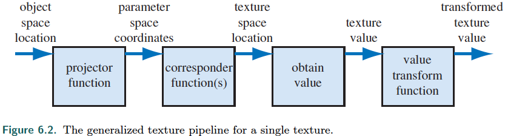
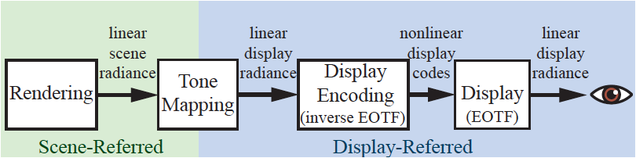
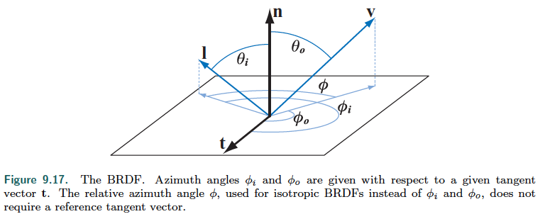
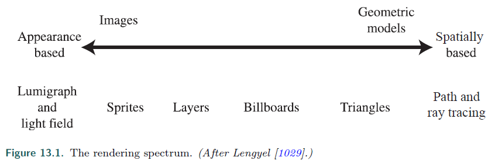

# Real-Time Rendering - 4th edition

## Questions

* What is _photon mapping_?

* (not from book) Give definitions of _unbiased_ and _biased_ rendering.

* In my quest for the meta-classification of shading algorithms/shading models, etc.
  * (not from book) https://en.wikipedia.org/wiki/List_of_common_shading_algorithms: distinguishes between _interpolation techniques_ and _illumination models_.
  Does not mention forward vs deferred.

* A strict definition of _alpha blending_?

* List all of the physical light/matter interaction: scattering, absorption, emission.

* Seems that the book divides specular reflections between mirror reflections (perfect, BRDF is a single ray?)
and glossy reflections (with a roughness > 0).

* Is subsurface scattering (and in particular the radiance it causes) considered reflection?
  p438 "[...] plus the reflected radiance" seems to imply it.

* Make a note with clear distinction, physical explanations, intuitive behaviours, dependence to light and view directions, ... :
  * diffuse illumination (independent of viewing angle: uniform appearance of light accross the surface, intensity of scaterred light primarly depends on angle of incidence: I suppose that is why it care about irradiance, all incoming lights will contribute, modulated by cos, to any viewing direction)
  * specular illumination (create highlights, strongly view dependent: intensity is strongest along specular direction determined by the incident angle and surface normal. It cares about radiance: only the limited set of incoming directions resulting in a specular component along viewing direction are of interest.)

| Feature                      | Specular Reflection                      | Diffuse Reflection                      |
|------------------------------|------------------------------------------|-----------------------------------------|
| **Surface Quality**          | Smooth surfaces                          | Rough surfaces                          |
| **Reflection Directionality**| Light is reflected in a single direction | Light is scattered in all directions    |
| **Dependence on View Angle** | Highly dependent                         | Largely independent                     |
| **Example Surfaces**         | Polished metal, glass, water             | Matte paint, paper, unpolished wood     |

* Note: Fundamentally, gathering is more amenable to fragment-shader parallelism compared to scattering. (parallel reads, unique write, vs parallel writes, unique read).

* Note: the special light sources (direction, point, spot) are also called _analytical lights_.

* Note: Light reflected from the surface is referred as specular light, from Latin _speculum_ (mirror)

## Effects and subset glossary

User controlled clipping planes via FS `discard`

_Deferred shading_ does _visibility_ and _shading_ in distinct passes.
It was given rise by the availability of _multiple render targets_ (MRT) p51

Deferred shading is categorized as:
* a type of _rendering pipeline_, and then as a class of _rendering method_ p51.
* a _technique_ p127
* a _rendering scheme_ p500.

_Parallax_ is the impact the observer's viewpoint have on the observation of an object.
(And apparently, the change in what is observed as the viewpoint changes).

_CIE_: Commission Internationale d'Eclairage.

Smoothstep and quintic equations, p181

## Chapter 1 - Introduction p1

Some operators:
* _Binomial coefficient_ (i.e. "_k parmi n_") $\binom{n}{k}$ = $C^k_n = \frac{n!}{k! (n-k)!}$
* Unary _perp dot product_, noted $^\perp$, work on a vector to give another vector perpendicular to it.

## Chapter 2 - The Graphics Rendering Pipeline p11

_Shading_ is the operation of determining the effect of light on a material.
It involves computing a __shading equation__ at various points on the object.

### Geometry processing p14

Model space -[model matrix]> World space -[view transform]> View (eye, camera) space -[projection matrix]-> clipping space / homogeneous clip space (clip coordinates, which are homogeneous)

In the clipping space, there is the _canonical view volume_ (unit cube) to which
the _drawing primitives_ are clipped by the _clipping stage_.

**Note**: the projection transforms the _view volume_
(bounded by a rectangular box (orthographic) or frustum (perspective) in view space)
into the unit cube of clipping space.

After clipping, _perspective division_ places vertices into _normalized device coordinates_ $[-1, 1]^3$.

_normalized device coordinates_ (NDC) -[screen mapping]-> (x, y [screen coordinates], z)[window coordinates]

Optionals:
* Tesselation shader
* Geometry shader
* Stream output (_transform feedback_ in OpenGL)

### Rasterization p21

_primitive assembly_ (_triangle setup_): Setup differentials, edge equations,...

triangle traversal: find which pixels or samples are inside a triangle, and generate fragments with interpolated properties.\
A _fragment_ is the piece of a triangle partially or fully overlapping a pixel (p49)

### Pixel processing p22

#### Fragment shading
Merging (ROP): _raster operations_ or _blend operations_. merge fragment shading output color(s) with data already present in the color buffer, handles depth buffer (z-buffer), stencil buffer. The _framebuffer_ consists of all enabled buffers.

## Chapter 3 - The Graphics Processing Unit p29

Give details of why a GPU is very efficient for graphics rendering, with details of the data-parallel architecture:
* _warps_ (nvidia) or _wavefronts_ (amd) grouping predefined numbers of _threads_ with the same shader program.
  Resident warps are said to be _in flight_, defining _occupancy_.
  Branching might lead to _thread divergence_.

Programmable shader stage has 2 types on input: _uniform_ and _varying_.

_Flow control_ is divided between _static flow control_ based on uniforms (no thread divergence) and _dynamic flow control_, which depends on varyings.

A detailed history of programmable shading and graphics API p37.

Geometry shader can be used to efficiently generate cascaded shadow maps.

Stream output can be used to skin a model and then reuse transformed vertices.

### The Pixel Shader p49

_Multiple Render Targets_ (MRT) allow pixel shaders to generates distinct values
and save them to distinct buffers (called Render Target).
E.g. color, depth, object ids, world space distance, normals

In the context of fragment shaders, a _quad_ is a group of 2x2 adjacent pixels,
processed together to give access to gradients/derivatives (e.g. texture mipmap level selection)
Gradients cannot be accessed in parts affected by dynamic flow control p51.
(I suppose because each thread in a quad has to compute its part for sharing with neighbors?)

A Render Target can only be written **at the pixel's location**.\
Dedicated buffer type allow write access to any location. _Unordered Access View_ (UAV) in DX / _Shader Storage Buffer Object_ (SSBO) in OpenGL.\
Data races are mitigated via dedicated _atomic units_, but they might lead to stalls.

### Merging stage p53
Output merger (DX) / Per-sample operations (OpenGL)

### Compute shader p54

A form of GPU computing, in that it is a shader not locked  into a location of the graphics pipeline.
Compute shaders give explicit access to a `thread ID`. They are executed by _thread group_,
all threads  in the group guaranteed to run concurrently, and share a small amount of memory.

## Chapter 4 - Transforms p57

* _Linear transforms_ preserve vector addition and scalar multiplication: scale, rotation
* _Affine transforms_ allow translation, they preserve parallelism of lines, but not necessarily length or angles.

For orthogonal matrices, the inverse is their transpose.

How to compute a look-at matrix p67

TODO: Note taken up-to 4.2.2 (excluded) in linear_algebra.md, to be completed.

### Morphing p90

Evolution _Morph Targets_ (_Blend Shapes_) p90

### Projections p92

Advices to increase depth precision p100

## Chapter 5 - Shading basics p103

A _Shading model_ describes how the surface color varies based on factors such as orientation, view direction, lighting.

Some models in this chapter:
* Lambertian
* Gooch

Shading models that support multiple light sources will typically use one of the following structures:

* $$
\mathbf{c}_\text{shaded} =
f_\text{unlit}(\mathbf{n}, \mathbf{v}) +
\sum_{i = 0}^{n-1}{
    \mathbf{c}_{\text{light}_i}
    f_\text{lit}(\mathbf{l}_i, \mathbf{n}, \mathbf{v})
}
\text{(5.5)}
$$
  * More general

* $$
\mathbf{c}_\text{shaded} =
f_\text{unlit}(\mathbf{n}, \mathbf{v}) +
\sum_{i = 0}^{n-1}{
    (\mathbf{l}_i \cdot \mathbf{n})^+
    \mathbf{c}_{\text{light}_i}
    f_\text{lit}(\mathbf{l}_i, \mathbf{n}, \mathbf{v})
}
\text{(5.6)}
$$
  * Required for physically based models
    * TODO: Why is it required? We could fold the dot product in $f_\text{lit} of equation (5.5)

**Note**: Varying values for materials properties (e.g. diffuse color, ambient color, ...)
exist in the functions $f$, even though they do not appear as explicit parameters.

The different types of light essentially describes how light vector $\mathbf{l}$ and light color $c_\text{light}$ vary over the scene.
These two parameters are how light sources interact with the shading model.

Lights:
* Directional light
* Punctual light
  * Point light (Omni light)
  * Spot light

### Implementing Shading Models p117

The different computations in shading have a _frequency of evaluation_ :
* Uniform frequency:
  * Per installation / configuration (can even be baked in the shader)
  * Valid for a few frames
  * Per frame
  * Per object
  * Per draw call
* Computed by one of the shader stages / Varying:
  * Per pre-tesselation vertex: in Vertex shader (colloquially: _Gouraud shading_)
  * Per surface patch: Hull shader
  * Per post-tesselation vertex: Domain shader
  * Per primitive: Geometry shader
  * Per fragment: Fragment shader (colloquially: _Phong shading_)

**Warnings**: p119 Interpolation of unit vectors might have non-unit result. (-> re-normalize after interpolation)\
Interpolation of differing length vector skew towards the longest. This is a problem with normals (-> normalize before interpolation), but is required for correct interpolation of directions (e.g. light)

p120: which coordinate system to choose for fragment shader computations:
* World space (minimize the work for transforming e.g. lights)
* View space (easy view vector, potentially better precision)
* Model space (uncommon)

_rendering framework_, undefined, p122. I think it corresponds to our library code.

"Clamping to $[0, 1]$ is quick (often free) on GPUs" p124

#### Material Systems p125

The _material system_ seems to handle the variety of materials, shading models, shaders.

A _material_ is an artist-facing encapsulation of the visual appearance of a surface.

Shader<->Material is not a 1-to-1 correspondance.
* A single material might use distinct shaders depending on the circonstances.
* A shader might be shared by several materials.
  A usual situation is material parameterization: a _material template_ plus parameter values produce a _material instance_.

"One of the most important task of a material system is dividing various shader functions into
separate elements and controlling how these are combined." p126
i.e. producing shader variants.\
This has to be handled at the source code level. The larger the number of variants, the more crucial are modularity and composability.

"Typically only part of the shader is accessible to visual graph authoring." p128

#### Screen-Based Antialiasing p137

Detailed overview of a lot of screen-based AA techniques (supersampling, temporal, morphological(image-based))

"Antialiasing (such as MSAA or SSAA) is resolved by default with a box filter" p142 (and it seems to mean taking the average color).
TODO: I do not understand why, since it seems box would just pick nearest...

### Transparency, Alpha, Compositing p148

Transparency:
* _alpha to coverage_ ?
* _stochastic transparency_ ?
* _alpha blending_
  "alpha simulates how much the material covers the pixel" p151
  (MSAA samples might already handle the fragment geometric coverage of the pixel).

_Blend modes_: usual is **over** when rendering transparent objects back to front, and there is also **under** (apparently only when rendering front to back?)

_order independent transparency_ (OIT):
* Depth peeling
* A-buffer
* Multi-layer alpha blending
* Weighted sum and Weighted average

_Pre-multiplied alphas_ (or _associated alphas_) are making the **over** operator more efficient, and make it possible to use **over** and **additive** blending within the same blend state.

### Display encoding p160

Displays have a (standardised) _electrical-optical transfer function_ (EOTF) (or _display transfer function_): it defines the relationship between the electric level of the signal and emitted radiance level (I assume the electric level is linear with the digital value in the color buffer).

Since our computations are done in linear (radiance) space, we need to apply the inverse of the EOTF to the final value written in the color buffer.
This way, the display will cancel it with the forward EOTF, and the expected radiance is displayed.
(This process of nullifying the display's non-linear response curve is called _gamma correction_, or _gamma encoding_, or _gamma compression_, since the EOTF is about $y = x^{\gamma}$)

"Luckily", human radiance sensitivity is close to the EOTF inverse. (**Note**: this human sensitivity is not what gamma correction corrects.)\
Thanks to that, the encoding is roughly _perceptually uniform_ :\
we perceive about the same difference between two encoded levels everywhere in encoded space, even though the absolute radiance difference is much smaller for smaller encoded values
(in other words, the EOTF mitigates banding).

Encoding is also called _gamma compression_.
It is a form of compression that preserves the perceptual effect over the limited precision
of the color buffer better than if there was no encoding
(banding would be more servere for small radiance values)\
Put another way, There is linear value used for physical computations, and display-encoded values (e.g. displayable image formats). We need to move data to(**encode**) or from(**decode**) the display-encoded form to either display it, or read images values for computations.

_sRGB_ defines the EOTF for consummer monitor displays.
It is closely approximated by $\gamma = 2.2$.

**Note**: a display does transform a sRGB non-linearly encoded image to linear radiance values. So the forward EOTF should be applied to linearize an image format that is sRGB encoded.

## Chapter 6 - Texturing p169

_texture mapping_ is assigning to a point (usually in model space) its _textures coordinates_.\
Note: _texture coordinates_ (usually $[0,1]^2$) are distinct from _texture space location_ (in the case on an image, it could be the pixel position)

_Wang tiles_: small set of square tiles with matching edges.

Texels have integer coordinates (do they mean indices?). In OpenGL, and since DX10, the center of a texel has coordinates (0.5, 0.5).
Origin is lower-left (OpenGL) or upper-left (DX).

_dependant texture read_ mean fragment shader has to "compute" the texture coordinates
instead of using the (u, v) passed from the VS verbatim.
There is an older, more specific definition: a texture read whose coordinates are dependent upon another texture read.

_power-of-two_ (POT) textures are $2^m \times 2^n$ texels. Opposed to NPOT.

_detail textures_ can be overlaid on magnified textures (cf [Blending and filtering materials](#blending_and_filtering_materials))

_mipmap chain_: set of images constituting all levels of a mipmapped texture.
The continuous coordinate $d$, or _texture level of detail_, is the parameter  determining where to sample in the levels of a mipmap chain (along the mipmap pyramid axis). OpenGL calls it $\lambda$.

The goal is a pixel-to-texel of at least 1:1 (so sampling (pixels) is at least twice the max signal frequency (1/2texels)).\
$(u, v, d)$ triplet allows for _trilinear interpolation_.\
A _level of detail bias_ (LOD bias) can be added to $d$ before sampling.

A major limitation of mipmaps is overblurring, because the filtering is isotropic (but the pixel backprojection into texture space can be far from a square).

_anisotropic filtering_:
_Summed-Area Table_ (SAT) p186\
_Unconstrained Anisotropic Filtering_ (in modern GPUs) p188\
_Elliptical Weighted Area_ (EWA) is a hight quality software approach.

_cube maps_ p190

Texture compression p192
* _S3 texture compression_ (S3TC) chosen as a standard in DX under the name _DXTC_ or _BC_. De facto OpenGL standard.
* _Ericson Texture Compression_ (ETC) p194, used in OpenGL ES (and GL 4). One component variant _Ericson Alpha Compression_.
* Variants for normal compression p195
  * _Adaptative Scalable Texture Compression_ (ASTC) p196.\
    All variants have _data compression assymetry_, decoding can be orders of magnitude faster than encoding.

There are approaches to reduce banding (e.g. histogram renormalization) p196

### Procedural Texturing p198

Noise function sampled at successive power-of-two frequencies (_octaves_),
weighted and summed to obtain a _turbulence_ function.
(Note _wavelet noise_ improves on _Perlin noise_).

### Material mapping p201
The idea is when using Material Parametrization, to fetch parameter values from textures.
Further, the texture value could control the dynamic flow of a shader, selecting different shading equations.\
**Warning**: shading model inputs with a linear relationship to output color (e.g. albedo) can be filtered with standard techniques. This is not the case for non-linear (roughness, normals,...)

### Alpha-mapping p202

The alpha value can be used for alpha-blending (blend stage) or alpha-testing(discard)
Used for _decaling_, _cutouts_ (e.g. _cross-tree_, _billboarding_),
Alpha-test has to take special care wrt mipmapping p204

_Alpha to coverage_ translates transparency as a MSAA coverage mask p207\
**Attention**: linear interpolation treat RGBA as premultiplied (which is usually not the case). A workaround is to paint transparent pixels p208

_Appearance modeling_ (Ch 9 p367) assumes different scales of observations,
influencing modelling approaches:
* _Macroscale_ (large scale, usually several pixels), as triangles
* _Mesosclae_ (middle scale, 1 to a few pixels), as textures, e.g. normal maps
* _Microscale_ (smaller than a pixel), encapsulated in the shading model, e.g. via the BRDF (Chapter 9)
* _Nanoscale_ ($[1, 100]$ wavelengths in size, unusual in real-time), by using wave optics models (Chapter 9)

### Bump-mapping p208
A family of small-scale (meso-feature) detail representation, essentially modifying the shading normal at fragment location.\
The frame of reference of the normal map is usual surface space, with a TBN matrix to change from object to surface.

**Note**: p210 "in [the case of textures mirrored on symmetric objects], the handedness of the tangent space will be different on the two side".
I think this is because the normal map will be applied on both sides,
and to actually mirror the resulting normal we need to mirror the TBN basis
(which changes its handedness).
Also, from Assimp doc: "The (bi)tangent of a vertex point in the direction of the positive X(Y) texture axis". This also implies mirroring the TBN basis when texture is mirrored.

Types of bump mapping:
* Blinn's method p211, via _offset vector bump map_ (offset map) or _height map_
* Normal mapping, via a _normal map_ (difficult to filter: the normal-map values have a non-linear relationship to the shaded color.):
  * Initially in world-space. Trivial to use, but objects cannot be rotated.
  * object-space allows rotation, but bind the map to a specific surface on a specific object (i.e. limit reuse).
  * tangent-space is the usual approach, but requires computing the TBN.

_Horizon mapping_ allows bumps to cast shadows onto their own surface.

### Parallax mapping p214

_Parallax mapping_ in general aims to determine what is seen at a pixel using a heightfield. It can give better occlusion/shadow clues.

Approaches:
* _Parallax mapping_ is an euristic (and cheap) approach that offsets texture coordinates before sampling the  albedo.
* _Parallax occlusion mapping_ (POM) or _relief mapping_ use ray marching along the view vector to find a better intersection with the heightfield. This approach can be extended with self-shadowing.
* _Shell mapping_ p220 approach allows to render silouhette edges of objects (otherwise showing the underlying primitive straight edge).

### Textured lights p221

Projective textures (called _light attenuation textures_ in this context)
can be used to modulate the light intensity of lights
(limited to a cone or frustum for normal texture, or all directions for cubemap).\
They are then called _gobo_ or _cookie_ lights (the textures are _light attenuation mask_, or _gobo maps_, or _cookie textures_)

## Chapter 7 - Shadows p223

_Occluders_ cast shadows on _receivers_.

Shadows are _umbra_ + _penumbra_.
* _Hard shadows_ do **not** have a penumbra
* _Soft shadows_ have a penumbra

### Planar shadows p225

_Planar shadows_ are a simple case where the shadows are cast on a planar surface.\
Idea to use stencil buffer to limit drawing shadows to a surface p227.

A _light map_ is a texture that modulate the intensity of the underlying surface (e.g. planar shadow rendered to a texture).

Heckbert and Herf's method p228 can be used offline to generate "ground-truth" shadows.
It can be extended to work with any algorithm producing hard-shadows.

### Shadow volume p230

_Shadow volumes_ are analytical, not image based, so they avoid sampling problems. They have unpredictable costs.

### Shadow Maps p234

_Shadow map_ (_shadow depth map_, _shadow buffer_) is the content of a z-buffer rendered from the light perspective.\

_Omnidirectional shadow maps_ capture the z-buffer all-around the light, typically via a six-view cube.

Prone to _self-shadow aliasing_ (_surface acne_, _shadow acne_).\
Mitigated via a _bias factor_, which is more effective when proportional to the angle between receiver and light: _slope scale bias_. Too much bias introduces _light leaks_ (_Peter Panning_).

_Second-depth shadow mapping_ renders only backfaces to the shadow map.

#### Resolution enhancement p240

_Resolution enhancement_ methods aim to address aliasing.

* _Perspective aliasing_ is the mismatch in coverage between the color-buffer pixels and texels in the shadow map (ideal ratio would be 1:1),
usually due to foreshortening occurring in the perspective view. It tends to show as "jagged" shadows.
* _Projective aliasing_ is due to surfaces forming a steep angle with the light direction, but are seen face one.

_Perspective warping_ techniques attempt to better match the light's sampling rates to the eye's, usually altering the light's view plane (via its matrix) so its sample distribution gets closers to the color-buffer (eye) samples:
* Perspective shadow maps (PSM)
* Trapezoidal shadow maps (TSM)
* Light space perspective shadow maps (LiSPSM).

Those tend to fail with _dueling frusta_ (_deer in the headlights_): i.e. when a light in front of the camera is facing at it.\
Additional problems such as sudden changes in quality had perspective warping fall out of favor.

Another approach it to generate several shadow maps for a given view.
The popular approach is _cascaded shadow maps_ (CSM), also called _parallel-split shadow maps_.
It requires _z-partitioning_ along the view.\
* _sample distribution shadow maps_ (SDSM) use previous frame z-depth to refine partitioning.

### Percentage-closer Filtering  p247

_Percentage-closer filtering_ (PCF) provides an approximation of soft-shadows by comparing the depth to several texels in the shadow-map,
returning an interpolation of the individual results.

_Percentage-closer soft shadows_ (PCSS) p250 aim for more accurate soft-shadows by sampling the shadow map to find possible occluders to vary the area of neighbours that will be sampled in the shadow map. This allows _contact hardening_.\
Enhancements are _contact hardening shadows_ (CHS), _separable soft shadow mapping_ (SSSM), _min/max shadow map_.

### Filtered Shadow Maps p252

_variance shadow map_ (VSM) allow filtering (blur, mipmap, summed area tables,...) the shadow maps.
This is efficient for rendering large penumbras. It suffers from _light bleeding_ for overlapping occluders.

Other approaches to filtered shadow maps are _convolution shadow maps_ , _exponential shadow map_ ESM (or _exponential variance shadow map_ EVSM), _moment shadow mapping_.

### Volumetric Shadow Techniques p257

_deep shadow maps_, _opacity shadow maps_, _adaptive volumetric shadow maps_

### Other Applications p262

_screen-space shadows_ ray march the camera's depth buffer treated as an height field.
(Good for faces, where small feature shadows are important)

Other analytical approaches:
* Ray tracing
* _Irregular z-buffer_ (IZB) p259 gives precise hard shadows.

## Chapter 8 - Light and Color

Our perception of color is a _psychophysical_ phenomenon: a psychological perception of physical stimuli.
* _Radiometry_ is about measuring electromagnetic radiation.
* _Photometry_ deals with light values weighted by the sensitivity of the human eye.
* _Colorimetry_ deals with the relationship between spectral power distribution and the perception of colors.

### Radiometry p267
* _radiant flux_ $\Phi$ in watts (W): flow of radiant energy over time.
* _irradiance_ $E = d\Phi / dA$ in W/m².
* _radiant intensity_ $I = d\Phi / d\omega$ in W/sr, flux density per direction (solid angle)
* _radiance_ $L = d^2\Phi/ (dA d\omega)$ in W/(m² sr), measure electromagnetic radiation in a single ray: the density of radiant flux with respect to both area and solid angle. It is what sensors (eye, camera, ...) measure. The area is measured in a plane perpendicular to the ray ("projected area").

_radiance distribution_ describes all light travelling anywhere in space.
In lighting equation, radiance at point $\mathbf{x}$ along direction $\mathbf{d}$ often appears as $L_o(x, d)$ (going out) or $L_i(x,d)$ (entering). By convention $\mathbf{d}$ always points away from $\mathbf{x}$.

_spectral power distribution_ SPD is a plot showing how energy is distributed across wavelength.

All radiometric quantities have spectral distributions.

### Photometry

Each radometric quantity has an equivalent photometric quantity (the differences are the _CIE photometric curve_ used for conversion, and units of measurement)

* _luminous flux_ in lumen (lm)
* _illuminance_ in lux (lx)
* _luminous intensity_ in candela (cd)
* _luminance_ in nit = cd/m²

### Colorimetry p272

CIE's XYZ coordinates define a color's _chromaticity_ and _luminance_.
_chromaticity diagram_, e.g; CIE 1931 taken by projection on the X+Y+Z=1 plane,
 is the lobe with the curved outline being the visible spectrum, with the straight line at the bottom called the _purple line_. The _white point_ define the _achromatic_ stimulus.
More perceptually uniform diagrams are developped, such as CIE 1976 UCS (part of the CIELUV color space).
A triangle in the chromaticity diagram represent the _gamut_ of a color space, with vertices being the primaries.
Given a $(x, y)$ color point on the chromaticity diagram and drawing a line
with the white point give the _excitation purity_ (\~= _saturation_) as relative distance from the point to the edge,
and the _dominant wavelength_ (\~= _hue_) as the intersection with the edge.

_spectral reflectance curve_ describes how much of each wavelength a surface reflects.

### Scene to screen p281

A _display standard_, such as sRGB, seems to encompass both a color-space (a RGB gamut defined by primitive colors, and a whitepoint) and display encoding function/curve. Also white luminance level (cd/m²).

#### HDR

_Dynamic range_ is about luminance?

_Perceptual quantizer (PQ)_ and _hybrid log-gamma_ (HLG) are non-linear display encodings defined by Rec. 2100 display standard.

_tone mapping_ or _tone reproduction_ is the process converting scene radiance values to display radiance values .
The applied transform is called the _end-to-end transfer function_ or _scene-to-screen transform_.
It transform the _image state_ from _scene-referred_ to _display-referred_.
Imaging pipeline:

Tone mapping can be seen as an instance of _image reproduction_: its goal is to create a display-referred images reproducing at-best the perceptual impression of observing the original scene.

Image reproduction is challenging: luminance of scene exceeds display capabilities by orders of magnitudes, and saturation of some colors are far out the display gamut.
It is achieved by leveraging properties of the human visual system:
* _adaptation_: compensation for differences in absolute luminance.

_exposure_ in rendering is a linear scaling on the scene-referred image **before** tone reproduction transform.

_global tone mapping_ (scaling by exposure then applying tone reproduction transform) where the same mapping is applied to all pixels, vs _local tone mapping_ with different mappings based on surrounding pixels.

_color grading_ manipulates image colors with the intention to make it look better in some sense. It is a form of _preferred image reproduction_.

## Chapter 9 - Physically Based Shading p293

TODO: clarify the list of physical interactions between light and matter, and their classification.
Is it reflection, transmission and absorption?
In particular, how to classify _refraction_ compared to _transmission_. Is refraction a separate effect occuring on transmitted light?

From "Entretien avec Luc, 02/06/2024": the only physical interaction between photons and matter should be scattering.
TODO: Maybe absorption is the another interaction?

Light-matter interaction: the oscillating electrical field of light causes the electrical charges in matter to oscillate in turn.
Oscillating charges emit new light waves, redirecting some energy of the incoming light wave in new direction. This reaction is _scaterring_ (fr: _diffusion_) (usually, same frequency).
An isolated molecule scatters in all directions, with directional variation in intensity.

Particles smaller than a wavelength _scatter_ light with constructive interference.
Particles beyond the size of a wavelength do not scatter in phase, the scattering increasingly favors the forward direction and the wavelength dependency decrease.

In _homogeneous medium_, scattered waves interfere destructively in all direction except the original direction of propagation. The ratio of phase velocities defines the _index of refraction_ IOR $n$. Some media are _absorptive_, decreasing the wave applitude exponentially with distance. The rate is defined by the _attenuation index_ $\kappa$. Those two optical properties are often combined into a single complex number $n + i\kappa$, the _complex index of refraction_.

A planar surface separating different indices of refraction scatter light a specific way: _transmitted wave_ and _reflected wave_.

Transmitted wave is refracted at an angle $\theta_t$, following _Snell's law_:
$$
\sin(\theta_t) = \frac{n_1}{n_2} \sin(\theta_i)
$$

In _geometrical optics_ light is modeled as rays instead of waves, and surfaces irregularities ar much smaller or much larger than wavelength.

On the other hand, when irregularities are in the range 1-100 wavelengths, _diffractions_ occurs.

_microgeometry_ are surface irregularities too small to be individually rendered (i.e. smaller than a pixel).
For rendering, microgeometry is treated statistically via the _roughness_.

_subsurface scattering_ p305
* _local subsurface scattering_ can be used when the entry-exit distance is smaller than the shading scale.
This local model should separate the _specular term_ for surface reflection from _diffuse term_ for local subsurface scattering.
* _global subsurface scattering_ is needed when the distance is larger than the shading scale (the inter-samples distance).

Camera p307

Sensors measure _irradiance_ over their surface.
Added enclosure, aperture and lens combine effect to make the sensor _directionally specific_, so the system now measures _radiance_.

#### BRDF p309

The ultimate goal of physically based rendering is to compute $L_i(\mathbf{c}, -\mathbf{v})$
for the set of view rays $\mathbf{v}$ entering the camera positioned at $\mathbf{c}$.

_participating media_ does affect the radiance of a ray via absorption or scattering.

Without participating media (i.e. in clean air, commonly assumed in rendering), given $\mathbf{p}$ is the intersection of the view ray with
the closest object surface:
$L_i(\mathbf{c}, -\mathbf{v}) = L_o(\mathbf{p}, \mathbf{v})$

The goal is now to calculate $L_o(\mathbf{p}, \mathbf{v})$.
We limit the discussion to local reflectance phenomena (no transparency, no global subsurface scattering), i.e. light received and redirected outward by the currently shaded point only:
* surface reflection
* local subsurface scattering

Local reflectance is quantified by the _bidirectional reflectance distribution function_ BRDF.
BRDF only depends on incoming light direction $\mathbf{l}$ and outgoing view direction $\mathbf{v}$,
and is noted $f(\mathbf{l}, \mathbf{v})$.
BRDF is often used to mean the _spatially varying BRDF_ SVBRDF (capturing the variation of the BRDF based on spatial location on the surface).

* A general BRDF at a given point has four parameter, elevations $\theta_i, \theta_o$, azymuths $\phi_i, \phi_o$.
* _Isotropic BRDF_ remains the same for a given azimuth difference between incoming and outgoing ray (i.e. not affected by a rotation of the surface around the normal).
It can be reduced to 3 parameters elevations $\theta_i, \theta_o$, azymuth difference $\phi$.

BRDF varies based on wavelength.
For real-time rendering the BRDF returns a spectral distribution as an RGB triples.

_Reflectance equation_, with $\Omega$ the hemisphere above the surface centered on $\mathbf{n}$:
$$
L_o(\mathbf{p}, \mathbf{v}) =
\int_{\mathbf{l} \in \Omega}{f(\mathbf{l}, \mathbf{v}) L_i(\mathbf{p}, \mathbf{l}) (\mathbf{n} \cdot \mathbf{l}) d\mathbf{l}}
\qquad\text{(9.3)}
$$

**Note**: $p$ is often omitted from the notation, giving equation $\text{(9.4)}$.

BRDF physical properties:
* _Helmoltz reciprocity_ $f(\mathbf{l}, \mathbf{v}) = f(\mathbf{v}, \mathbf{l})$ (often violated by renderers). Can be used to assert a BRDF physical plausibility.
* _conservation of energy_ outgoing energy cannot exceed incoming energy.

_directional-hemispherical reflectance_ can measure to what degree a BRDF is energy conserving. It measures the amount of light,
coming from a single direction $\mathbf{l}$, reflected over all directions:
$$
R(\mathbf{l}) =
\int_{\mathbf{v} \in \Omega}
    {f(\mathbf{l}, \mathbf{v}) (\mathbf{n} \cdot \mathbf{v}) d\mathbf{v}}
$$

_hemispherical-directional reflectance_ measure the amount of light, coming from all directions of the hemisphere, that is reflected toward a given direction $\mathbf{v}$:

$$
R(\mathbf{v}) =
\int_{\mathbf{l} \in \Omega}
    {f(\mathbf{l}, \mathbf{v}) (\mathbf{n} \cdot \mathbf{l}) d\mathbf{l}}
$$

For a reciprocal BRDF, directional-hemispherical reflectance is equal to the hemispherical-directional reflectance. In this situation, _directional albedo_ is a blanket term for both, they can be used interchangeably.

**Note**: For a BRDF to be energy conserving, $R(\mathbf{l})$ is in the range $[0, 1]$ for any $\mathbf{l}$, but the BRDF does not have this restriction and can go above $1$.

A Lambertian BRDF p313 has a constant value (independent of incoming direction $\mathbf{l}$).
So does the directional-hemispherical reflectance, whose constant value is called _diffuse color_ $\mathbf{c}_{diff}$ or the _albedo_ $\rho$ (or in this chapter, _subsurface albedo_ $\rho_\text{ss})$:
$$
R(\mathbf{l}) = \pi f(\mathbf{l}, \mathbf{v}) = \rho_\text{ss}
$$
$$
f(\mathbf{l}, \mathbf{v}) = \frac{\rho_\text{ss}}{\pi}
$$

TODO: derive that $\int_{\mathbf{l} \in \Omega} (\mathbf{n} \cdot \mathbf{l}) d\mathbf{l}$ is $\pi$.

#### Illumination p315

$L_i(\mathbf{l})$ term in the reflectance equation is the incoming light from all directions.

_Global illumination_ calculates $L_i(\mathbf{l})$ by simulating how light propagates and reflects throughout the scene, by using the _rendering equation_

**Note**: The reflectance equation is a special case of the rendering equation.

_Local illumination_ algorithms uses the reflectance equation to compute shading locally at each surface point,
and are given $L_i(\mathbf{l})$ as input which does not need to be computed.

We can define a light color $\mathbf{c}_{light}$ as the reflected radiance from a white Lambertian surface facing toward the light ($\mathbf{n} = \mathbf{l}$)

TODO: does it mean $L_i(l) = \mathbf{c}_\text{light}$ ? Seems implied by the simplified reflectance equation.
Plus radiance is indeed denoted by $L$.

In the case of directional and punctual lights and local illumination (i.e. direct light contribution), each surface point $\mathbf{p}$ receive (at most) a single ray from each light source, along direction $\mathbf{l}_c$, simplifying the reflectance equation to:
$$
L_o(\mathbf{v}) =
\pi f(\mathbf{l}_c, \mathbf{v}) \mathbf{c}_{light} (\mathbf{n} \cdot \mathbf{l}_c)
$$

Clamping the dot product to zero to discard lights under the surface, the resulting contribution for $n$ lights is:
$$
L_o(\mathbf{v}) =
\pi \sum_{i=1}^{n} f(\mathbf{l}_{c_i}, \mathbf{v}) \mathbf{c}_{light_i} (\mathbf{n} \cdot \mathbf{l}_{c_i})^+
$$
**Note**: this ressembles equation (5.6) p109, with $\pi$ cancelled out by the $/\pi$ often appearing in the BRDFs.

#### On to a specific phenomena: Fresnel reflectance p316

_Fresnel equations_ are complex and not presented in the chapter.

Light incident on flat surface splits into a reflected part and a refracted part.
The direction of reflection $\mathbf{r}_i$ forms the same angle $\theta_i$ with the surface normal $\mathbf{n}$ as $\mathbf{l}$ does:
$$
\mathbf{r}_i = 2 (\mathbf{n} \cdot \mathbf{l}) \mathbf{n} - \mathbf{l}
$$

_Fresnel reflectance_ $F$ is the amount of light reflected (as a fraction of incoming light, i.e. a reflectance).
It depends on $\theta_i, n_1, n_2$.

_External reflection_ (e.g. "air to material") when $n_1 < n_2$, _internal reflection_ when $n_1 > n_2$.

Characteristics of $F(\theta_i)$ for a given substance interface:
* At _normal incidence_ ($\theta_i = 0°$), the value is is a property of the substance, noted $F_0$ : the _normal-incidence Fresnel reflectance_.
  It can be seen as the characteristic specular color of this substance.
* As $\theta_i$ increases, $F(\theta_i)$ tend to increase, reaching a value of $1$ for all frequencies (white) at $\theta_i = 90°$. This increase in reflectance at glancing angles is often called the _Fresnel effect_.

An approximation of the complex equation for Fresnel reflectance is given by Schlick:
$$
F(\mathbf{n}, \mathbf{l}) \approx F_0 + (1 - F_0) (1 - (\mathbf{n} \cdot \mathbf{l})^+)^5
$$

Pointers to other approximations are given p320, or the option to use other powers than $5$.

A more general form of the Schlick approximation, giving control over the color at 90° $F_{90}$:
$$
F(\mathbf{n}, \mathbf{l}) \approx F_0 + (F_{90} - F_0) (1 - (\mathbf{n} \cdot \mathbf{l})^+)^{\frac{1}{p}}
$$

* Dielectrics (insulators) have low $F_0$, which makes the Fresnel effect especially visible. Their optical properties rarely varies over the visible spectrum.
* Metals have a high $F_0$ (usually above 0.5), which is colored. They immediately absorb any transmitted light: they do not exhibit subsurface scattering or transparency. So all the visible color comes from $F_0$.
* Semiconductors have $F_0$ in between, but are rarely needed to render. Usually, the range [0.2, 0.45] is avoided for practical realistic purposes.

Parameterizing Fresnel values p324 discusses parameters of PBR models.

From the observation that metals have no diffuse color,
and that dielectrics have a restricted set of possible $F_0$ values:
an often-used parameterization combines specular color $F_0$ and diffuse color $\rho_\text{ss}$,
parameters being an RGB surface color $\mathbf{c}_\text{surf}$ and a scalar _metalness_ $m$.
* If $m = 1$, $F_0$ is set to $\mathbf{c}_\text{surf}$, $\rho_{ss}$ is set to black.
* If $m = 0$, $F_0$ is set to a plausible dielectric value (e.g. 0.04, or another param),
$\rho_\text{ss}$ is set to $\mathbf{c}_\text{surf}$

Metalness has some drawbacks:
* cannot express some types of materials, such a coated dielectrics with tinted $F_0$.
* artifacts can occur on the boundaries between metal and dielectric.

Parameterization trick: since $F_0$ lower than 0.02 are very unusual,
low values can be reserved for a specular occlusion mask,
to suppress specular highlights in cavities.

##### Internal reflection p325

When $n_1 > n_2$, then $\theta_t > \theta_i$. So a _critical angle_ $\theta_c$ exists where no transmission occurs: all incoming light is reflected. This phenomenon is _total internal reflection_ occurring when $\theta_i > \theta_c$.

$F(\theta_i)$ curve for internal reflection is a "compressed" version of the curve for external reflection,  with the same $F_0$ and perfect reflectance reached at $\theta_c$ instead of 90°.

It can occur in dielectrics (not metals which absorb), which have real-valued refractive indices:
$$
\sin \theta_c = \frac{n_2}{n_1} = \frac{1 - \sqrt{F_0}}{1 + \sqrt{F_0}}
$$

#### Microgeometry p327

Microgeometry models surface irregularities that are smaller than a pixel, but larger than 100 wavelengths.
Most surfaces have an _isotropic_ distribution of the microscale surface normals (i.e. rotationally symmetrical).

Effects of microgeometry on reflectance:
* multiple surface normals
* _Shadowing_: the occlusion of the light source by microscale surface details. -> hidden form $\mathbf{l}$.
* _Masking_: some facets hiding others from the point of view. -> hidden form $\mathbf{v}$
* _Interreflection_: light may undergo multiple boundes before reaching the eye.
  * subtle in dielectrics, light is attenuated by the Fresnel reflectance at each bounce.
  * source of any visible diffuse reflection in metals (I do not understand why the distribution of normals is not also a source of diffuse reflection?), since metals do no exhibit subsurface scattering. They are more deeply colored than primary reflection, since they result from light interacting multiple times with the surface.

For all surfaces types, visible size of irregularities decresses as angle to the normal $\theta_i$ increases. This combines with the Fresnel effect to make surfaces appear highly reflective at glancing angles (lighting and viewing).

TODO: classify the different types of reflections, and define generic [reflection](https://en.wikipedia.org/wiki/Reflection_(physics)#Reflection_of_light).
The book differentiates _specular reflectance_ ("surface reflectance") from _subsurface reflectance_ (I suppose _diffuse reflectance_) p330.\
This is consistent with what appears on wikipedia
[Specular reflection](https://en.wikipedia.org/wiki/Specular_reflection) vs [Diffuse reflection](https://en.wikipedia.org/wiki/Diffuse_reflection).

Microscale surface details can also affect _subsurface reflectance_.
If microgeometry irregularities are larger than subsurface scattering distance,
their shadowing and masking can cause _retroreflection_:
"where light is preferentially reflected back toward its incoming direction" p330.

#### Microfacet theory p 331

_Microfacet theory_ is a mathematical analysis of the effects of microgeometry on reflectance,
on which many BRDF models are based.
The theory is based on the modeling of microgeometry as a collection of _microfacets_:
* each is flat, with a single normal $\mathbf{m}$.
* each individually reflects light according to the micro-BRDF $f_\mu(\mathbf{l}, \mathbf{v}, \mathbf{m})$. Their combined reflectances add up to the overall surface BRDF.

The model has to define the statistical distribution of microfacet normals:
* $D(\mathbf{m})$ is the _normal distribution function_ NDF (or _distribution of normals_).
  It tells us how many of the microfacets have normals pointing in certain directions.
* $G_1(\mathbf{m}, \mathbf{v})$ is the _masking function_,
the fraction of microfacets with normal $\mathbf{m}$ that are visible along view vector $\mathbf{v}$. (note: does not address shadowing).
* The product $G_1(\mathbf{m}, \mathbf{v})D(\mathbf{m})$ is the _distribution of visible normals_.

The projections of the microsurface and macrosurface onto the plane perpendicular to any view direction are equal:

$$
\int_{m \in \Theta} D(\mathbf{m})(\mathbf{v} \cdot \mathbf{m}) d\mathbf{m}
= \mathbf{v} \cdot \mathbf{n}
\text{, dot products under integration are NOT clamped to 0 (9.22)}
$$
$$
\int_{m \in \Theta} G_1(\mathbf{m}, \mathbf{v}) D(\mathbf{m})(\mathbf{v} \cdot \mathbf{m})^+ d\mathbf{m}
= \mathbf{v} \cdot \mathbf{n}
\text{, dot products ARE clamped to 0 (9.23)}
$$

Heitz solved the dilemma (for now) as to which $G_1$ to use.
From the masking function proposed in the litterature, only two satisfy equation 9.23:
* Torrance-Sparrow "V-cavity".
* Smith masking function.
  * Closer match to behavior of random microsurfaces than Torrance-Sparrow.
  * _normal-masking independance_: does not depends on the direction of $\mathbf{m}$ as long as it is frontfacing.
  * drawbacks:
    * theoretically not consistent with structure of actual surfaces
    * practically, it is quite accurate for random surfaces, but less when there is a strong dependency between normal direction and masking.

Smith $G_1$:
$$
G_1(\mathbf{m}, \mathbf{v}) =
\frac{\chi^+(\mathbf{m} \cdot \mathbf{v})}{1 + \Lambda(\mathbf{v})}
$$
with:
* $\chi^+(x)$ the positive characteristic function: 1 when $x > 0$, 0 when $x \leq 0$.
* $\Lambda$ function differing for each NDF.

From those elements, the overall macrosurface BRDF can be derived:
$$
f(\mathbf{l}, \mathbf{v}) =
\int_{m \in \Omega}
    f_\mu(\mathbf{l}, \mathbf{v}, \mathbf{m})
    G_2(\mathbf{l}, \mathbf{v}, \mathbf{m})
    D(\mathbf{m})
    \frac{(\mathbf{m} \cdot \mathbf{l})^+}{|\mathbf{n} \cdot \mathbf{l}|}
    \frac{(\mathbf{m} \cdot \mathbf{v})^+}{|\mathbf{n} \cdot \mathbf{v}|}
    d\mathbf{m}
\qquad \text{(9.26) p334}
$$

TODO: Get an intuition of for the two dot product ratios?

$G_2(\mathbf{l}, \mathbf{v}, \mathbf{m})$ is the _joint masking-shadowing function_.
It derives from $G_1$, and accounts for masking as well as shadowing (but not interreflection),
giving the fraction of microfacets with normal $\mathbf{m}$ that are visible from two directions:
* view vector $\mathbf{v}$
* light vector $\mathbf{l}$

Several forms of $G_2$ are given p335. Heitz recommends the _Smith height-correlated masking-shadowing function_:
$$
G_2(\mathbf{l}, \mathbf{v}, \mathbf{m}) =
\frac{\chi^+(\mathbf{m} \cdot \mathbf{v}) \chi^+(\mathbf{m} \cdot \mathbf{l})}
     {1 + \Lambda(\mathbf{v}) + \Lambda(\mathbf{l})}
$$

For rendering, the general microfacet BRDF $\text{(9.26)}$ is used to derive a closed-form solution given a specific choice of micro-BRDF $f_\mu$.

#### BRDF models for surface reflection p336

With few exceptions, specular BRDF terms used in PBR are derived from microfacet theory.

The _half vector_ $\mathbf{h}$ is given by:
$$
\mathbf{h} = \frac{\mathbf{l} + \mathbf{v}}{||\mathbf{l} + \mathbf{v}||}
$$

In the case of specular reflection, each microfacet is a perflectly smooth Fresnel mirror (reflect each incoming ray in a single reflected direction).
So, $f_\mu(\mathbf{l}, \mathbf{v}, \mathbf{m})$ is zero unless $\mathbf{m}$ is aligned with $\mathbf{h}$.

This collapses the integral into an evaluation of the integrated function at $\mathbf{m} = \mathbf{h}$:
$$
f_{\text{spec}}(\mathbf{l}, \mathbf{v}) =
\frac{
    F(\mathbf{h}, \mathbf{l})
    G_2(\mathbf{l}, \mathbf{v}, \mathbf{h})
    D(\mathbf{h})
}
{
    4 |\mathbf{n} \cdot \mathbf{l}| |\mathbf{n} \cdot \mathbf{v}|
}
$$

TODO: is $F(\mathbf{h}, \mathbf{l})$ used as the micro-BRDF $f_\mu(\mathbf{l}, \mathbf{v}, \mathbf{m})$? It would make some sense, since the microfacet are perfect mirrors (their whole contribution is the reflectance).

Note: the book points at optimization to avoid calculating $\mathbf{h}$ and to remove $\chi^+$ p337.

Now formulas for the NDF $D$ and the masking-shadowing function $G_2$ must be found.

##### Normal Distribution Functions p337

The shape of the NDF determines the width and shape of the cone of reflected rays
(i.e. the specular lobe), which determines the size and shape of specular highlights.

###### Isotropic NDF p338

An isotropic NDF is _shape-invariant_ if the effect of its roughness parameter is equivalent to scaling the microsurface.
* An arbitrary isotropic NDF has a $\Lambda$ function depending on two variables, roughness $\alpha$ and incidence angle.
* For a shape-invariant NDF, $\Lambda$ only depends on variable $a$
  (with $\mathbf{s}$ replaced by either $\mathbf{v}$ or $\mathbf{l})$:
  $$
  a = \frac{\mathbf{n} \cdot \mathbf{s}}{\alpha \sqrt{1 - (\mathbf{n} \cdot \mathbf{s})^2}}
  $$

Isotropic Normal Distribution Functions:
* Beckmann NDF p338 (first microfacet model developed by the optics community)
  is chosen for the Cook-Torrance BRDF. The NDF is _shape-invariant_.
* Blinn-Phong NDF p339 (less expensive to compute than others)
  was derived by Blinn as a modification of the (non physically based) Phong shading model.
  $$
  D(\mathbf{m}) =
  \chi^+(\mathbf{n} \cdot \mathbf{m})
  \frac{\alpha_p + 2}{2 \pi}
  (\mathbf{n} \cdot \mathbf{m})^{\alpha_p}
  $$
  * $\alpha_p$ is the roughness parameter of the Blinn-Phong NDF (higher is smoother).
    * Since it is visual impact is highly non-uniform, its is often mapped non-linearly
      to a user-manipulated parameter, such as $s \in [0, 1]$ in $\alpha_p = m^s$
      with constant $m$ being the upper-bound (e.g. 8192).
    * Equivalent values for the Beckmann and Blinn-Phong roughnesses are found using
      $ \alpha_p = 2 \alpha_b^{-2} - 2$.
  * It is not shape-invariant, and an analytic form for its $\Lambda$ function does not exist.
    * Walter et al. suggest using the Beckmann $\Lambda$ with the parameter equivalent function above.
* _Trowbridge-Reitz distribution_ NDF p340(recommended by Blinn in a 1977 paper)
  was rediscovered by Walter et al. who named it _GGX distribution_,
  which is now the common name.
  $$
  D(\mathbf{m}) =
  \frac{
     \chi^+(\mathbf{n} \cdot \mathbf{m})
     \alpha_g^2
  }
  {
     \pi
     (1 + (\mathbf{n} \cdot \mathbf{m})^2 (\alpha_g^2 - 1))^2
  }
  $$
  * $\alpha_g$ roughness control is similar to that provided by Beckmann $\alpha_b$.
    * In the Disney principled shading model, the user-manipulated roughness parameter $r \in [0, 1]$ maps as $\alpha_g = r^2$. It has a more linear visual effect, and is widely adopted.
  * It is shape-invariant, with a relatively simple $\Lambda$:
  $$
  \Lambda(a) =
  \frac{-1 + \sqrt{1 + \frac{1}{a^2}}}{2}
  $$
    * note: $a$ only appears squared, which avoids a squareroot to compute it.
  * the popularity of GGX distribution and Smith masking-shadowing function has lead to several optimizations for combination of the two p341. Notably:
  $$
  \frac
    {G_2(\mathbf{l}, \mathbf{v})}
    {4|\mathbf{n} \cdot \mathbf{l}||\mathbf{n} \cdot \mathbf{v}|} \Longrightarrow
  $$
  $$
  \frac
    {0.5}
    {
      (\mathbf{n} \cdot \mathbf{v})^+
       \sqrt{\alpha_g^2 + (\mathbf{n} \cdot \mathbf{l})^+
             ((\mathbf{n} \cdot \mathbf{l})^+ - \alpha_g^2 (\mathbf{n} \cdot \mathbf{l})^+)}
      +
      (\mathbf{n} \cdot \mathbf{l})^+
       \sqrt{\alpha_g^2 + (\mathbf{n} \cdot \mathbf{v})^+
             ((\mathbf{n} \cdot \mathbf{v})^+ - \alpha_g^2 (\mathbf{n} \cdot \mathbf{v})^+)}
    }
\qquad \text{(9.43)}
  $$
* _generalized Throwbridge-Reitz_ (GTR) p342 NDF goal is to allow more control over the NDF's shape (specifically the tail). It is not shape-invariant.
* _Student's t-distribution_ STD and _exponential poweer distribution_ EPD p343 are shape invariant, and quite new (unclear if they will find use atm).

An alternative to increasing NDF complexity is to use multiple specular lobes p343.

###### Anisotropic NDF p343

Note $\theta_m$ Is (polar) angle of the microfacet normal with the macrosurface normal $\mathbf{n}$.

Rough outline:
* The tangent and bitangent have to be perturbed by the normal map (and an optional _tangent map_) to obtain the TBN frame where $\mathbf{m}$ is expressed. p344
* Obtain an anisotropic version of the NDF, presented for _Beckmann NDF_ and _GGX NDF_ p345
* Optionally use a custom parameterization for both roughness $\alpha_x$ and $\alpha_y$. Presented for **Disney principled shading model** and **Imageworks**.

##### Multiple-bounce surface reflection

Imageworks combines elements from previous work to create a multiple-bounce specular term **that can be added** to the specular BRDF.
$$
f_{\text{ms}}(\mathbf{l}, \mathbf{v}) =
\frac
{
    \overline{F} \text{ } \overline{R_{\text{sF1}}}
}
{
    \pi
    (1 - \overline{R_{\text{sF1}}})
    (1 - \overline{F} (1 - \overline{R_{\text{sF1}}}))
}
(1 - R_{\text{sF1}}(\mathbf{l}))
(1 - R_{\text{sF1}}(\mathbf{v}))
$$

* $R_{\text{sF1}}$ is the directional albedo of $f_{\text{sF1}}$
  * $f_{\text{sF1}}$ is the specular BRDF term with $F_0$ set to 1
  * $R_{\text{sF1}}$ depends on $\alpha$ and $\theta$, it can be precomputed numerically (32x32 texture is enough according to Imageworks).
* $\overline{F}$ and $\overline{R_{\text{sF1}}}$ are the cosine weighted averages over the hemisphere.
    * $\overline{F}$ closed forms are provided p346
    * $\overline{R_{\text{sF1}}}$ can be precomputed in a 1D texture (or curve-fitted), it solely depends on $\alpha$, see p346

#### BRDF models for subsurface scattering p347

Scoped to local subsurface scattering (diffuse surface response in opaque dielectrics)

Subsurface albedo $\rho_\text{ss}$ is the ratio of energy (of light) that escape a surface compared to the energy entering the interior of the material.
It is modeled as an RGB value (a spectral distribution), and often referred as the _diffuse color_ of the surface (Similarly $F_0$ is often referred as the _specular color_ of the surface).
It seems it might also be referred as the _diffuse reflectance_, p450.
It is related to the scattering albedo (chapter 14)

For dielectrics, it is usually brighter than the specular color $F_0$.
Subsurface albedo results from a different physical process (absorption in the interior, I guess what escape is the complement) than specular color (Fresnel reflectance at the surface).
Thus it typically has a different spectral distribution than $F_0$.

**Important**: Not all values in the sRGB color gamut are plausible subsurface albedos, p349.

Some BRDF models for local subsurface scattering take roughness into account by using a diffuse micro-BRDF $f_\mu$ (microfacet theory), some do not:
* If microgeometry irregularities are larger than subsurface scattering distances, microgeometry-related effects such as retroreflection occur.
  * A rough-surface diffuse model is used, typically treating ss as local to each microfacet,
thus only affecting the micro-BRDF $f_\mu$.
* If scattering distances are larger than microgeometry irregularities, the surface should be considered flat when modeling subsurface scattering (retroreflection does not occur).
Subsurface scattering is not local to a microfacet, thus cannot be modeled via microfacet theory.
  * A smooth-surface diffuse model should be used.

##### Smooth-surface subsurface models p350

Diffuse shading is not directly affected by roughness.

* local subsurface scattering is often modelled with a Lambertian term:
  $$
  f_\text{diff}(\mathbf{l}, \mathbf{v}) = \frac{\rho_\text{ss}}{\pi}
  $$

* It can be improved by an energy trade-off with the surface (specular) reflectance:
  * If the specular term is a microfacet BRDF term:
    $$
    f_\text{diff}(\mathbf{l}, \mathbf{v}) =
    (1 - F(\mathbf{h}, \mathbf{l})) \frac{\rho_\text{ss}}{\pi}
    \qquad \text{(9.63)}
    $$
  * If the specular term is a flat mirror:
    $$
    f_\text{diff}(\mathbf{l}, \mathbf{v}) = (1 - F(\mathbf{n}, \mathbf{l})) \frac{\rho_\text{ss}}{\pi}
    \qquad \text{(9.62)}
    $$

**Note**: The flat mirror using $F(\mathbf{n}, \mathbf{l})$ and the microfacet specular term using $F(\mathbf{h}, \mathbf{l})$.
This is consistent with the fact that for microfacet BRDF, we had set $m = h$.

See section for a larger selection of available equations.

##### Rough-surface subsurface models p353

* _Disney diffuse_ model p353
  * by default, use the same roughness as the specular BRDF, which limits materials.
    But a separate "diffuse roughnes" could be easily added
  * Apparently not derived from microfacet theory
* Oren-Nayar BRDF (the most-well known) p354
  * Assume a microsurface with quite different NDF and masking-shadowing than those used in current specular models.
* Derivations from the isotropic GGX NDF:
  * Gotanda p355. Does not account for interreflections, has a complex fitted-function.
  * Hammon p355. Uses interreflections, fairly simple fitted-function.
    * Fundamentally assumes that irregularities are larger than scattering distances, which may limit materials it can model.

#### Cloth p356

#### Wave optics BRDF models p359

_Wave optics_, or _physical optics_, by opposition to _geometrical optics_,
is required to model the interaction of light with
_nanogeometry_: irregularities in the range [1-100] wavelength.

No diffraction occurs below 1 wavelength, and above 100 the angle between diffracted light and specularly reflected is so small it becomes negligible.

##### Diffraction models p360

Nanogeometry causes _diffraction_.

TODO: define diffraction.

##### Thin-film interference p361
_Thin-film interference_ is a wave optics phenomenon occuring when light paths reflect
from the top and bottom of a thin dielectric layer and interfere with each other.
The path has to be short (so the film has to be thin) because of _coherence length_:
the maximum distance a copy of a light wave can be displaced and still interfere coherently
(this length is inversely proportional to the bandwidth of the light).
For the human visual system (400-700 nm), coherence length is about 1μm.

#### Layered material p363

Simple and visually significant case of layering is _clear coat_:
a smooth transparent layer over a substrate of a different material.

Visual effect of clear-coat:
* Double reflection (clear-coat and underlying substrate).
  Most notable when the difference in IOR is large (e.g. metal substrate).
* Might be tinted (by absorption in the dielectric)
* In the general case, layers could have different surface normals (but uncommon for real-time rendering).

#### Blending and filtering materials p365

Ideally, when blending between materials (when staking, or at mask soft-boundaries),
the corect approach would be to compute each material, then blend linearly between them.
The same result is achieved by blending the linear parameters and computing the material,
but blending non-linear BRDF parameters is theoretically unsound.
Yet, in real-time rendering, this is the usual approach, and the results are satisfying.

Blending normal-maps requires special consideration
(e.g. treating as a blend between equivalent height-maps), see p366.

"Material filtering is a topic closely related to material blending." TODO: understand why

_specular antialiasing_ techniques mitigate flickering highlights due to specular aliasing.
(e.g. due to linearly filtering normals, or BRDF roughness,
which have an non-linear relationship to the final color).
There are other potential artifacts (e.g. unexpected changes in gloss with viewer distance), but specular aliasing is usually the most noticeable issue.

##### Filtering normals and normal distributions p367

Illustrate the issue of naive linear filtering of normal map and roughness.

Propose some solution for better filtering.
* Toksvig's method (intended for Blinn-Phong NDF, but usable with Beckmann):
  $$
  \alpha_p' =
  \frac
  {
    ||\overline{\mathbf{n}}|| \alpha_p
  }
  {
    ||\overline{\mathbf{n}}|| + \alpha_p (1 - ||\overline{\mathbf{n}}||)
  }
  $$
  * Usable with GGX with translation function for roughness, even though it does not have good theoretical foundation for it.
  * Works with the simplest normal mipmapping scheme: linear averaging without normalization.
  * Does not work well with compression techniques for normal, which require normals being unit length.

There is another family of mapping techniques (based on mapping the covariance matrix of the normal distribution): _LEAN_, _CLEAN_, _LEADR_. p370 (I do not understant it atm).

TODO: understand what are the variance mapping techniques.
_variance mapping_ family of techniques is commonly used for static normal-maps predominent in real-time rendering.

## Chapter 10 - Local Illumination p375

There are two solid angles to correctly apply reflectance equation to shade a pixel:
* solid angle covered by the pixel projection on the surface. (Addressed in chapter 9, see note below.)
* solid angle sustaining all radiance from a light.

Note:
figure 10.2 states that chapter 9 presented the integral over the projected footprint of the pixel on the surface.
I suppose this is notably because the different texture maps (normal, roughness, ...) should ideally represent
the averaged value over the fragment surface (especially approaching 1:1 fragment to texel).
And the NDF averages the microscale effect at the scale of a fragment.

This chapter aims to take extend shading with the solid angle _subtended_ by actual lights
(i.e. not punctual).

### 10.1 Area Light Source p377

An area light source brightness is represented by its radiance $L_l$.\
It subtends a solid angle $\omega_l$ of the hemisphere $\Omega$
of possible incoming light directions around surface normal $\mathbf{n}$.\
The area light contribution to the outgoing radiance in direction $\mathbf{v}$ is given
by the reflectance equation (presented with the fundamental approximation behind infinitesimal light source) :
$$
L_o(\mathbf{v}) =
\int_{l \in \omega_l} f(\mathbf{l}, \mathbf{v}) L_l (\mathbf{n} \cdot \mathbf{l})^+ d\mathbf{l}
\approx \pi f(\mathbf{l_c}, \mathbf{v}) \mathbf{c}_\text{light} (\mathbf{n} \cdot \mathbf{l_c})^+
\qquad \text{(10.1)}
$$

Punctual and directional lights are approximations, thus introducing visual errors depending on two factors:
* size of the light source (measured as the solid angle it covers from the shaded point). Smaller is less error.
* glossiness of the surface. Rougher is less error.

Observations:
* For a given difference in subtended angle, rougher surface show less size difference in resulting specular highlight.
* The rougher the surfaces, the larger the specular highlight

#### Lambertian surfaces

For Lambertian surface, area light can be computed exactly using a point light.
For such surfaces, outgoing radiance is proportional to the irradience $E$ (TODO: why?):
$$
L_o(\mathbf{v}) = \frac{\rho_\text{ss}}{\pi}E
\qquad \text{(10.2)}
$$

_vector irradiance_ (initially introduced as _light vector_) $\mathbf{e}(\mathbf{p})$
allows to convert an area light source (or several) into a point or directional light source.
$$
\mathbf{e}(\mathbf{p}) =
\int_{\mathbf{l} \in \Theta} L_i(\mathbf{p}, \mathbf{l}) \mathbf{l} d\mathbf{l}
\qquad \text{(10.4)}
$$
(where $\Theta$ is the whole sphere)

**IMPORTANT**: following derivations are correct **only** if there is no "negative side" irrandiance.

The general solution is then to use the substitutions:
$$
\mathbf{l}_c = \frac{\mathbf{e}(\mathbf{p})}{|| \mathbf{e}(\mathbf{p}) ||}
$$
$$
\mathbf{c}_\text{light} =
\mathbf{c}' \frac{|| \mathbf{e}(\mathbf{p}) ||}{\pi}
\qquad \text{(10.7)}
$$

TODO: I did not understand the derivation in this section

##### Special case of spherical light

For a spherical light source centered at $\mathbf{p}_l$ with radius $r_l$.
It emits a constant radiance $L_l$ from every point on the sphere, in all directions:

$$
\mathbf{l}_c = \frac{\mathbf{p}_l - \mathbf{p}}{|| \mathbf{p}_l - \mathbf{p} ||}
$$
$$
\mathbf{c}_\text{light} =
\frac{r_l^2}{|| \mathbf{p}_l - \mathbf{p} ||^2}
L_l
\qquad \text{(10.8)}
$$

Which is the same as an omni light with $c_{\text{light}_0} = L_l$, $r_0 = r_l$, and a standard
inverse square distance falloff.

##### wrap lighting

_wrap lighting_ seems to mean a lighting that "wraps" the scene.
It is achieved in rendering by modifying the usual $\mathbf{n} \cdot \mathbf{l}$ value before clamping it to 0.
TODO: get a more rigorous definition

From the observation that effects of area lighting are less noticeable for rough surface :
wrap lighting gives a less physically based but effective method to model area lighting
of Lambertian surfaces.

$$
E = \pi c_\text{light}
    \left( \frac{(\mathbf{n} \cdot \mathbf{l}) + k_\text{wrap}}{1 + k_\text{wrap}} \right)^+
\qquad \text{(10.9)}
$$

with $k_\text{wrap}$ in the range $0$ (point light) to $1$ (area light covering the hemisphere).

Valve form to mimic a large area light:

$$
E = \pi c_\text{light}
    \left( \frac{(\mathbf{n} \cdot \mathbf{l}) + 1}{2} \right)^2
\qquad \text{(10.10)}
$$

#### 10.1.1 Glossy Materials p382

Model the effect of area lights on non-Lambertian materials:
* Primary effect is the highlight, with size and shape similar to the area light
  (edge blurred according to roughness)

Usual methods (which is used in real-time rendering for a variety of problems) are based on finding,
per shaded point, an equivalent punctual light setup that would mimic the effect
of non-infinitesimal light.

* Mittring's _roughness modifification_ p383 alters roughness parameter to reshape the BRDF specular lobe.
  * Karis applies it to GGX BRDF and spherical area light:
$$
\alpha' = \left( \alpha_g + \frac{r_l}{ 2 || \mathbf{p}_l - \mathbf{p} || } \right)^\mp
$$
    * breaks for very shiny materials.

* _most representative point_ solution p384 represent area lights with a light direction that changes
  with the point being shaded: the light vector is set to the direction of the point on the area
  light contributing the most energy toward the surface.
  * Note: This ressemble the idea of _importance sampling_ in _Monte Carlo integration_
  (numerically computing a definite integral by averaging samples over the integration domain).
      * _importance sampling_: prioritize samples with a large contribution to the overall average,
        which is a _variance reduction_ technique.
      * Monte Carlo integration is based on sequence of pseudo-random numbers
      * Quasi-Monte Carlo, by contrast use low-discrepency sequences (also called quasi-random sequences)

#### 10.1.2 General Light Shapes p 386

* _tube lights_ or _capsules_ p387
* _planar area lights_ p388 are defined as a section of a plane bound by a geometrical shape:
  * _card light_ are bound by rectangle
    * Drobot developed one of the first practical approximations p388
      (a representative point solution)
  * _disk lights_ are bound by a disk
  * _polygonal area lights_ are bound by a polygon
    * Lambert, refined by Arvo then Lecocq, for glossy materials modeled as Phong specular lobes p389

A different approach is _linearly transformed cosines_ (LTCs) p390
is practical, accurate and general (more expensive that representative point, but much more accurate).\
Cosines on the sphere are expressive (via linear transformation) and can be integrated easily
over arbitrary spherical polygon.
The key observation is that integration of the LTC (with 3x3 transform $T$) over a domain
is equal to the integral of the cosine lobe over the domain transformed by $T^{-1}$.

Approximations have to be found to express generic BRDFs as one or more LTCs over the sphere.

### 10.2 Environment Lighting p391

Although there is not physical difference, in practice implementations distinguish between:
* direct light usually with relatively small solid angle and high radiance (should cast shadows).
* indirect light tends to diffusely cover the the whole hemisphere, with moderate to low radiance.

**Note**: This section talks about indirect and environment lighting,
but does not investigate global illumination.
The distinction is that the shading does not depend on the other surfaces in the scene,
but rather on a small set of light primitives.
(i.e. the shading algorithm receives light sources as input, not other geometry).

#### Ambient light

Simplest model of environment lighting is _ambient light_: the radiance does not vary with direction,
it has constant value $L_A$.

For arbitrary BRDF, the integral is the same as the directional albedo $R(\mathbf{v})$:
$$
L_o(\mathbf{v}) =
L_A \int_{\mathbf{l} \in \Omega}{f(\mathbf{l}, \mathbf{v}) (\mathbf{n} \cdot \mathbf{l}) d\mathbf{l}} =
L_A R(\mathbf{v})
$$

And for the particual case of Lambertian surfaces:
$$
L_o(\mathbf{v}) =
\frac{\rho_\text{ss}}{\pi} L_A \int_{\mathbf{l} \in \Omega}{(\mathbf{n} \cdot \mathbf{l}) d\mathbf{l}} =
\rho_\text{ss} L_A
$$

### 10.3 Spherical and Hemispherical Functions p392

To extend environment lighting beyond a constant term, incoming radiance should
depend on direction onto the object.
This can be represented by _spherical functions_: defined over the surface of the unit sphere,
or over the space of direction in $\mathbb{R}^3$. This domain is denoted $S$.

_spherical bases_ are the representations, presented later TODO: define much better

_projection_ is converting a function to a given representation.\
_reconstruction_ is evaluating the value of a fuction from a given representation.

#### 10.3.1 Simple Tabulated Forms

Representation is a table of values associated to a selection of several directions.
Evaluation involves finding a number of samples around the evaluation direction and reconstructing
the value with some interpolation.

_Ambient cube_ (AC) is one of the simplest tabulated forms p395.
It is equivalent to a cube map with a single texel on each cube face.

#### 10.3.2 Spherical Bases p395

Spherical radial basis functions (SRBF) p396:
* _Spherical Gaussians_ (SG) (or _von Mises-Fisher distribution_ in directional statistics) p397
  * One drawback is their _global support_: each lobe is non-zero for the entire sphere.
    Thus if N lobes are used to represent a function, all N lobes are needed for reconstruction.
* _Spherical harmonics_ (SH) p398 (more rigorously: _real spherical harmonics_, only the real-part)
* _Linearly Transformed Cosines_ (LTC) representation can efficiently approximate BRDFs.
* _Spherical wavelets_ p402 basis balances locality in space (compact support) and in frequency (smoothness).
* Spherical piecewise constant basis functions
* Biclustering approximations

#### 10.3.3 Hemispherical Bases p402

For hemispherical functions, half of the signal is zero, hemispherical bases are less wasteful.
This is especially relevant for functions defined over surfaces
(BRDF, incoming radiance, irradiance arriving at a point).

* _Ambient/Highlight/Direction_ (AHD) basis p402 TODO: understand
* _Radiosity normal mapping_ (or _Half-Life 2 basis_) p402 TODO: understand
  * works well for directional irradiance
* _Hemispherical harmonics_ (HSHs), specialize spherical harmonics to the hemispherical domain.
  * _H-basis_ take part of the SH basis for longitudinal parameterization and parts of the HSH for latitudinal.
    * Allows for efficient evaluation

### 10.4 Environment Mapping p404

_Environment mapping_: records a spherical function in one or more images.
(Typically uses texture mapping to implement lookups in the table).
* This is a powerful and popular form of environment lighting.
* Trades a large memory usage for simple and fast decode.
* Highly expressive:
  * higher frequency by increasing resolution
  * higher range of radiances by increasing bit depth of channels

A limitation of environment mapping: it does not work well with large flat surfaces.
They will result in a small part of the environment table mapped onto a large surface.

_Image-based lighting_ (IBL) p406 is another name for illuminating a scene with texture data,
typically when the environment map is obtained from real-world HDR 360° panoramic photographs.

Shading techniques make approximations and assumptions on the BRDF to perform the integration
of the environment lighting:
* _reflection mapping_: most basic case of environment mapping, assuming the BRDF is a perfect mirror.
  * An optically flat surface, or mirror, reflects an incoming ray of light to the light's reflection direction $\mathbf{r}_i$.
    Outgoing radiance includes incoming radiance from just **one** direction (reflected view vector $\mathbf{r}$).
  * Reflectance equation for mirrors is greatly simplified:
    $$ L_o(\mathbf{v}) = F(\mathbf{n}, \mathbf{r}) L_i(\mathbf{r}) \qquad \text{(10.29)}$$
    * $L_i$ only depends on the direction, it can be stored in a two-dimensionnal table (the textures),
      called an _environment map_.
    * Access information is computed by using some _projector function_: maps $r$ into one or more textures.

A variety of projector functions:
* _Latitude-longitude mapping_ (or _lat-long mapping_) p406
  * Keeps distance between latitude lines constant, unlike Mercator projection
* _Sphere mapping_ p408
  * Texture image is derived from the environment viewed orthographically in a perflectly reflective sphere:
    the circular texture is called a _sphere map_
    or _light probe_ (it captures the lighting situation at the sphere's location) .
    * Photographs of spherical probes is an efficient method to capture image-based lighting.
  * Drawback is that the sphere map captures a view of the environment only valid for a single view direction.
    * Conversion to other view directions is possible, but can result in artifacts due to magnification
      and singularity around the edge.
  * The reflectance equation can be solved for an arbitrary isotropic BRDF and results stored in a sphere map.
    * This BRDF migh include diffuse, specular, retroreflection, and other terms.
  * Several sphere maps might be indexed,
    e.g. one with reflection vector, one with surface normal to simulate specular and diffuse environment effects.
* _Cube mapping_ p410
  * Most popular tabular representation for environment lighting, implemented in hardware by most modern GPUs.
  * Accesses a _cube map_ (originally _cubic environment map_), created by projecting environment
    onto the sides of a cube.
  * _view-independent_ (unlike sphere mapping) and has more uniform sampling that lat-long mapping.
    * _isocube_ mapping p412 has even lower sampling-rate discrepencies while using same hardware.
* _Dual paraboloid environment mapping_ p413
* _Octahedral mapping_ p413 maps the surrounding sphere to an octahedron (instead of a cube)
  * good alternative when cube map texture hardware is not present
  * can also be used as compression method to express 3D directions (normalized vectors)
    using 2 coordinates.

### 10.5 Specular Image-Based Lighting p414

Extension of environment mapping, originally developed for rendering mirror-like surfaces,
to glossy reflections.\
The environment map also called _specular light probe_ when used to simulate general specular
effects for infinitely distant light sources

**Note**: _probing_ term is used because the map captures the radiance from all
directions at a given point in the scene.

_specular cube maps_ is used for the common case of storing in cube maps.

TODO: p423 fig. 10.38 understand why the GGX BRDF lobe, in red, is stronger when the polar coordinate is larger than this of the reflection vector.
I would expect it to be the other way, as masking-shadowing should be larger as incoming light gets further away from the surface normal and $\mathbf{n} \cdot \mathbf{l}$ gets smaller (which seems to be consistent with the "off-specular" figure 11 of mftpbr).

### 10.6 Irradiance Environment Mapping p424

Categorization:
* Environment maps for specular reflections:
  * Indexed by the reflection direction (potentially skewed).
  * Contain **radiance** values.
  * Unfiltered: used for mirror reflections.
    * Contain incoming radiance values, along the sampled direction.
  * Filtered: used for glossy reflections.
    * Contain outgoing radiances values, along the view vector reflecting the sampled direction.
* Environment maps for diffuses reflections:
  * Indexed by the surface normal.
  * Contain **irradiance** values.

#### Other representations

_Precomputed radiance transport_ (PRT) is the general idea of precomputing lighting to account for all interactions.

### 10.7 Sources of Error

A common real-time engine approach:
* Model a few important lights analytically. Approximate integrals over light area and compute shadow maps for occlusion
* Other light sources (distant, sky, fill, light bounces over surfaces) are represented:
  * by environment cube maps for the specular component
  * by spherical bases for diffuse irradiance

In such mix of technique, the consistency between different forms of lighting might be more important than absolute error committed by each.

## Chapter 11 Global Illumniation - p437

_Radiance_ is the final quantity computed by the rendering process.
So far we used the _reflectance equation_.

### 11.1 The Rendering Equation p437

The full _rendering equation_ was presented by Kajiya in 1986.
We use the following form:

$$
L_o(\mathbf{p}, \mathbf{v}) =
L_e(\mathbf{p}, \mathbf{v})
+
\int_{\mathbf{l} \in \Omega}{
    f(\mathbf{l}, \mathbf{v})
    L_o(r(\mathbf{p}, \mathbf{l}), -\mathbf{l})
    (\mathbf{n} \cdot \mathbf{l})^+
    d\mathbf{l}}
\qquad\text{(11.2)}
$$

With the following differences from the _reflectance equation_:
* $L_e(\mathbf{p}, \mathbf{v})$ is the emitted radiance from location $\mathbf{p}$ in direction $\mathbf{v}$.
* $L_o(r(\mathbf{p}, \mathbf{l}), -\mathbf{l})$ (replacing $L_i(\mathbf{p}, \mathbf{l})$) states that
  incoming radiance at $\mathbf{p}$ from $\mathbf{l}$ is equal to the outgoing radiance
  from another point defined by $r(\mathbf{p}, \mathbf{l})$ in the opposite direction $-\mathbf{l}$.
  * $r(\mathbf{p}, \mathbf{l})$ is the _ray casting function_, it returns the location of the first
  surface point hit by a ray cast from $\mathbf{p}$ along direction $\mathbf{l}$.

Defining $L_o$ in term of the integration of other $L_o$ makes it a recursive integral.

Important properties of the _rendering equation_:
* It is _linear_ with respect to the emitted lighting
  (scaling the light sources scale the result by same factor).
* The response for each light is independent from all other sources
  (thus each could be computed in isolation).

The local lighting model need the surface data only at visible points to compute the lighting.
(Common in real-time rendering, being what GPUs are most efficient: processing primitives independently).

Transparency, reflections, shadows are thus example of _global illuminations_ algorithms
(using information from other surfaces than the point currently illuminated).

Alternatively, in local lighting model, photons travel from the light to a surface (illuminated point) then to the eye. Above _global illuminations_ effects consider interaction of photons with other intervening objects:
* Shadowing consider intervening objects' direct occlusion
* Reflections can use environment or irradiance map to capture light reaching distant objects
  and reflect it to compute the illumination of local surfaces.

Heckbert developed a notational scheme to formally describe the paths simulated by a technique:
* $L$: light
* $E$: eye
* $D$: diffuse photon interaction
* $S$: specular photon interaction

Note: Categorization can be extended. Defines "glossy" as: shiny but not mirror-like (p439).

Algorithms are briefly summarized via regular expressions describing what interaction they simulate.
e.g.:
* Direct illumination: $L(D|S)E$.
  * If light has a geometry and go directly to the eye: $L(D|S)?E$.
* Environment mapping: $L(D|(S|D)?S)E$
* The rendering equation: $L(D|S)*E$.

_Global illumination_ research focuses on methods to compute light transport along some of these paths.Two common strategies are to simplify and to precompute.

TODO: define _light transport_

### 11.2 General Global Illumination p441

Algorithms to solve the full rendering equation:
instead of incoming radiance $L_i$ being given, radiance is emitted or reflected from other points.

#### 11.2.1 Radiosity p442

_Radiosity_ was the first CG technique to simulate bounced light between **diffuse** surfaces: $LD*E$.
It can compute interreflections ans soft shadows.
The name comes from the quantity that is computed by the algorithm.

It relies on the finite element method and consider each surface a light source at equilibrium.

Radiosity see each surface as composed of some patches, each with an average radiosity value.
The radiosity for patch $i$ is:
$$
B_i = B^e_i + \rho_{ss} \sum_j{F_{ij} B_j}
\qquad\text{(11.4)}
$$

* $B^e_i$ is the radiant _exitance_ of patch $i$ (the radiosity it emits). Non-zero only for light sources.
* $\rho_{ss}$ is the subsurface albedo.
* $F_{ij}$ is the _form factor_ between patches $i$ and $j$, a geometric term giving the fraction of
  uniform diffuse radiant energy leaving patch $i$ that is incident upon patch $j$.
  These fractions add up to $1$:
  (TODO: are patch indices reversed? We copied the book)
  * $$
    F_{ij} = \frac{1}{A_i}
    \int_{A_i}{
        \int_{A_j}{
            V(\mathbf{i}, \mathbf{j})
            \frac{\cos{\theta_i} \cos{\theta_j}}{\pi d^2_{ij}}
            da_i da_j
        }
    }
    \qquad\text{(11.5)}
    $$
      * $A_i$, $A_j$: the areas of patches $i$ and $j$.
      * $V(\mathbf{i}, \mathbf{j})$: the visibility function between points $i$ and $j$
        ($0$ if occluded, $1$ otherwise).
      * $\theta_i$, $\theta_j$: angle between the patch normal and the ray connecting points $i$ and $j$.
      * $d_{ij}$: length of the ray (distance between points $i$ and $j$).

Equations (11.4) for all patches are combined in a single linear system that is then solved to obtain
the radiosity value for every patch.

#### Ray Tracing 11.2.2

* _ray casting_ is the process of firing a ray from a location to determine what objects are in a particular direction (i.e. visibility?)
* _ray tracing_ uses rays to determine light transport between scene elements.

Classical ray tracing / most basic form: shot rays from camera through pixel grid.
From the closest hit, shoot rays toward light (determine shadow or transparent attenuation/refraction), in reflected or refracted direction, as approriate.
It is limited to hard shadows, sharp reflections and refractions.
Is it what is called a _Whitted_ raytracer? (from Turner Whitted).

This underlying principle can be used to solve the full rendering equation $L(D|S)*E$.
Shooting rays and evaluating how much light they carry is used to compute the integral in (11.2).
Because of the recursion, for every ray the integral is evaluated again at the intersection. Integrals are evaluated via _Monte Carlo_ methods.

Ray are shot to point-sample the integrand. At the intersection, the new integral is solved by point-sampling the integral again.
The ray bounces to build a _path_, the light carried along each path provides one evaluation of the integrand: this procedure is called _path tracing_.

Path tracing can render mirror-like, glossy or diffuse material, soft shadows,
transparent objects along with caustic effects.
It can handle fog and subsurface scattering if extended to sample points in volumes.

Downside is computational complexity, and _high variance_ (close points could have vastly different lighting) which manifests as noise.
_importance sampling_ can be used to mitigate this effect without additional paths.

11.3 11.4 are concerned with occlusions (visibility of light sources from shaded points).
11.5 11.6 are simulating not only occlusion but also full light bounces.

### 11.3 Ambient Occlusion p446

_Ambient occlusion_ (AO) is a basic global illumination effect developped in early 2000s.
It inexpensively provides cues about shapes when lightin lacks directional variations
(e.g. environment lighting).

#### 11.3.1 Ambient Occlusion Theory p446

Surface irradiance is the cosine-weighted integral of incoming radiance, assumed constant here
$L_i(\mathbf{l}) = L_A$:
$$
E(\mathbf{p}, \mathbf{n})
= \int_{\mathbf{l} \in \Omega}{L_A (\mathbf{n} \cdot \mathbf{l})^+ d\mathbf{l}}
= \pi L_A
\qquad\text{(11.6)}
$$

For Lambertian surfaces, outgoing radiance $L_o$ is proportional to surface irradiance $E$.
From (11.6), it results that $L_o$ is constant under constant uniform illumination,
as it does not depend from location $\mathbf{p}$ or normal $\mathbf{n}$.
It leads to a flat appearance.

It can be extended with visibility $v(\mathbf{p}, \mathbf{l})$ that equals $0$ if a ray cast from $\mathbf{p}$ in direction of $\mathbf{l}$ is blocked, $1$ otherwise:
$$
E(\mathbf{p}, \mathbf{n})
= L_A \int_{\mathbf{l} \in \Omega}{v(\mathbf{p}, \mathbf{l}) (\mathbf{n} \cdot \mathbf{l})^+ d\mathbf{l}}
\qquad\text{(11.7)}
$$

Ambient occlusion $k_A(\mathbf{p})$ is the cosine-weighted integral of the visibility function,
a cosine-weighted percentage of the unoccluded hemisphere:
$$
k_A(\mathbf{p})
= \frac{1}{\pi} \int_{\mathbf{l} \in \Omega}{v(\mathbf{p}, \mathbf{l}) (\mathbf{n} \cdot \mathbf{l})^+ d\mathbf{l}}
\qquad\text{(11.8)}
$$

Giving:
$$
E(\mathbf{p}, \mathbf{n}) = k_A(\mathbf{p}) \pi L_A \qquad\text{(11.9)}
$$

This way, irradiance changes with surface location $\mathbf{p}$.

The _bent normal_ is the cosine-weighted average unoccluded direction:
$$
n_{bent} =
\frac
    {\int_{\mathbf{l} \in \Omega}{\mathbf{l} v(\mathbf{l}) (\mathbf{n} \cdot \mathbf{l})^+ d\mathbf{l}}}
    {|| \int_{\mathbf{l} \in \Omega}{\mathbf{l} v(\mathbf{l}) (\mathbf{n} \cdot \mathbf{l})^+ d\mathbf{l}} ||}
\qquad\text{(11.10)}
$$

#### 11.3.2 Visibility and Obscurance p449

_Obscurance_ modifies the ambient occlusion computation, to replace
visibility function $v(\mathbf{l})$
with a continuous distance mapping function $\rho(\mathbf{l})$ (valued $1$ above $d_{\text{max}}$):
$$
k_A(\mathbf{p})
= \frac{1}{\pi}
\int_{\mathbf{l} \in \Omega}{\rho(\mathbf{l}) (\mathbf{n} \cdot \mathbf{l})^+ d\mathbf{l}}
\qquad\text{(11.11)}
$$

#### 11.3.3 Accounting for interreflections p450

Reasoning to assume that $L_i$ from blocked directions is equal to $L_o$ of currently shaded point,
to obtain a new factor $k'_A$:
$$
k'_A = \frac{k_A}{1 - \rho_{ss}(1 - k_A)}
\qquad\text{(11.13)}
$$

#### 11.3.4 Precomputed Ambient Occlusion p451

The process of precomputing any lighting-related information is often called _baking_.

_Malley's method_ use importance sampling, casting a cosine-weighted distribution of ray, to compute AO.

Pointers to precompute data to model AO effects of objects on each other p452.
Pointers to use AO in indirect illumination solutions p453.

Note: AO decouples visibility calculations from lighting (so, usable with dynamic lighting).

#### 11.3.5 Dynamic Computation of Ambient Occlusion p453

Provide better results for dynamic scenes. Two groups of methos:
* Object space
  * Disk at vertices, SDF, _cone tracing_ p455, collection of spheres with SH p456
    * SH methods producing high-order coefficients augment AO with directional occlusion info
* Screen space

#### 11.3.6 Screen-Space Methods p457

_Screen-space ambient occlusion_ (SSAO) is a dynamic method developed by Crytek compute AO in a full-screen pass using
z-buffer only.
Also points at other methods with ad-hoc heuristics.

SSAO could be interpreted as Monte Carlo integration, calculating the _volumetric obscurance_ $v_A$ p459 (11.15).

It can be augmented with normal buffer, e.g. _volumetric ambient occlusion_ p459.

_Horizon-base ambient occlusion_ (HBAO) estimate visibility by determining _horizon angles_.
_Ground-truth ambient occlusion_ (GTAO) is an horizon-based approach aiming to match results from ray tracing.

To limit the required number of samples, screen-space methods employ some form of spatial-dithering
(TODO: define in this context.),
such as using slightly different set of samples, followed by full-screen joint bilateral filtering.
Calculations can also be supersampled over time, requiring previous data to be reprojected to current view.

#### 11.3.7 Shading with Ambient Occlusion p463

Apply AO to more complex lighting scenarios, lifting the limitation to constant illumination.
Demonstration to arrive at:
$$
L_o =
k_A \rho_{ss} \int_{\mathbf{l} \in \Omega}{L_i(\mathbf{l}) K(\mathbf{n}, \mathbf{l})d\mathbf{l}}
\qquad\text{(11.22)}
$$

With:
$$
K(\mathbf{n}, \mathbf{l}) =
\frac
{v(\mathbf{l}) (\mathbf{n} \cdot \mathbf{l})^+}
{\int_{\mathbf{l} \in \Omega}{v(\mathbf{l}) (\mathbf{n} \cdot \mathbf{l})^+} d\mathbf{l}}
\qquad\text{(11.23)}
$$

(11.22) can be thought as applying filter $K$ to incoming radiance $L_i$.

One approach it to approximate $K$ with a simpler filter, such as the _normalized cosine kernel_ $H$:
$$
H(\mathbf{n}, \mathbf{l}) =
\frac
{(\mathbf{n} \cdot \mathbf{l})^+}
{\int_{\mathbf{l} \in \Omega}{(\mathbf{n} \cdot \mathbf{l})^+} d\mathbf{l}}
\qquad\text{(11.24)}
$$

This approximation gives:
$$
L_o =
\frac{k_A}{\pi} \rho_{ss} E \qquad\text{(11.25)}
$$

This means that, in this simple form, shading with AO can by performed by computing irradiance
(e.g. irradiance env map) and multiplying it by AO value $k_A$.

Note: Ignoring visibility, as in (11.25), is a significant approximation.
This approximation highlights why AO is not a good choice for modeling visibility of highly
directional lights (it entirely remove light visibility from the equation).

Also, we assumed Lambertian surfaces, since a more complex non-constant BRDF cannot be pulled out of the integral.
So AO makes most sense for diffuse BRDFs.

Using the bent normal make for a better approximation of (11.23), p 467.

### 11.4 Directional Occlusion p467

AO is a poor approximation for visibility for lights with more directionality (area light, punctual, ...) or complexity (e.g. strong gradient), and cannot correctly deal with glossy BRDFs.

This section will focus on methods that the entire spherical or hemispherical visibility.
Meant to be used mainly for occlusion of large area light or environment lighting,
where generated shadow are soft (and artifacts caused by approximated visibility are not noticeable).
Alternatively, can provide occlusion when regular shadowing techniques are not feasible
(self-shadowing bump-map, extremely large scene).

#### 11.4.1 Precomputed Directional Occlusion p 466

_ambient aperture lighting_ models the set of unoccluded 3D directions as a whole as an circular aperture.
(Other methods could use elliptical aperture).

Possibility to use _spherical signed distance function_ (SSDF) to represent visibility.
Or any spherical/hemispherical base can encode visibility.

As with AO, directional visibility information can be stored in textures, mesh vertices, or volumes.

#### 11.4.2 Dynamic Computation of Directional Occlusion p467

Note: Using more bands in SH allow encoding visibility with more precision.

Many methods used in AO can be used to generate directional visibility information.
Cone tracing can be restricted to one direction.
Also screen-space methods, e.g. _screen-space bent cones_.

#### 11.4.3 Shading with Directional Occlusion p468

Visibility function is $0$ when light:
* falls under the horizon (horizon mapping)
* falls outside the visibility cone (ambient aperture lighting)
* falls in the negative area of the SSDF

Distinct approximations and restrictions, offering trade-offs between generality, runtime cost and
quality.

Present reasoning for punctual lights p468,
extend to area-lights p468 (visibility is $0$ except in a solid angle subtended by the light),
assuming Lambertian surface (i.e. constant BRDF).

Move onto environment lighting (remove restriction on solid angle), still Lambertian p470 \
Introduce _zonal harmonics_ (ZH), a subset of SH for which a single coefficient per band is non-zero.
The cosine $\mathbf{n} \cdot \mathbf{l}$ projects to ZH.\
Precomputing $\bar{v(\mathbf{l})} = v(\mathbf{l})(\mathbf{n} \cdot \mathbf{l})^+$ is a form of _precomputed radiance transfer_. It prevents fine-scale modification of the normal.

Then onto glossy BRDFs (not constant), with or without dependence on view angle p471. \
Can approximate the BRDF with a set of _spherical Gaussians_, representable by:
* direction (or mean) $d$, standard deviation $\mu$, amplitude $w$.

### 11.5 Diffuse Global Illumination

Cover simulating full light bounce in real time, last bounce of a diffuse surface, i.e light path:
$L(D|S)*DE$.
Assume lighting changes smoothly (or is constant) on hemisphere above shaded point.

#### 11.5.1 Surface Prelighting p473

Precompute the results of expensive computation for _static_ objects,
as baking prevents changing geometry, lights or materials.
_Dynamic_ objects act only as receivers (they neither occlude light nor generate indirect illumination): their effect is either ignored or modeled with other techniques (e.g. screen-space occlusion).

Simplest lighting info to precompute is irradiance.
Light source independence allows to add dynamic lights on top of precomputed irradiance.
_Exitance_ is irradiance times diffuse color.
Since diffuse color is high-frequency but repeatable, while irradiance is low-frequency but unique,
it is better to store them separated.

TODO: why irradiance can only be precomputed for flat-surfaces?
What prevents a statically known but spatially varying normal?

#### 11.5.2 Directional Surface Prelighting p475

Prelighting together with normal mapping on Lambertian surfaces.
Also coverage of dynamic geometry.

General method is storing full spherical irradiance, e.g. in SH
* 3rd order (9 coeff) give excellent results but storage & bandwith costs are high.
* 2n order (4 coeff) is less costly, but the quality is visibly degraded.
Present variations, both for lower cost or high quality.

TODO: For a high quality approach also usable for low-gloss specular BRDF see:
Pettineo, Matt, “SG Series Part 6: Step into the Baking Lab,” The Danger Zone blog, Oct. 9, 2016.

#### 11.5.3 Precomputed Transfer p 478

Precomputed lighting is inherently static.
It is possible to precompute how light interacts with (static) models and allow light to change
(at runtime cost).

Function that take incoming lighting and return a descrption of the radiance distribution
throughout the scene is called _transfer function_.
Solutions that precompute this are called _precomputed transfer_ or _precomputed radiance transfer_ (PRT).

##### Techniques to precompute transfer from a number of elements then used to model the lights

e.g. Precompute how the scene respond to light distribution represented by SH basis functions.
Then project a dynamic environment lighting to those SH bands. p480.

Discussion of applying _principal component analysis_ (PCA) p480.

Applying to indoor lighting with clustered static lights then interpolated for the dynamic lighting
p481.

##### Techniques to precompute transfer between surfaces p482

TODO: understand

The actual source of illumination becomes irrelevant:
For such methods, the input is the outgoing radiance from a set of surface, not the lights directly.
Seems to imply we do direct-illumination calculations on "source" elements. TODO: How?
There is also a set of "receiver" elements, to wich the "source" elements transfer light.
The preprocessing step computs how light is transferred between sources and receivers.

> The outgoing radiance for all source elements is provided to the system. TODO: How?

Draws from _progressive radiosity_ as it computes one light bounce at a time
(and does not solve a system of linear equations, unlike radiosity).
The process of transferring radiance to the receiving location is called _gathering_.

#### 11.5.4 Storage Methods p484

Note: those methods can also be used to store ambient and directional occlusion, as they share
many spatial characteristics of diffuse lighting. p491

When values are filtered on the GPU, care must be taken to obtain valid values (e.g. renormalize).

_light maps_ collectively describe all textures that store precomputed lighting information.
More specific terms might be used to denote the specific type of data, such as _irradiance map_.

Mipmapping usually not needed (a lightmap texel covering a large area of geometry).
Since lightmap texels are not reused, mapping require an _unique parameterization_.

_charts_ or _shells_ are the chunks of mesh in texture space.
Charts filtering footprints must stay separate to avoid bleeding.
_grid-preserving parameterization_ can be used to create ligtmaps free from seam artifacts.

Storing precomputed lighting on vertices is rarely used p487.

(alternative to light maps) _Irradiance volumes_ represent 5-dimensional irradiance function
with sparse spatial sampling of irradiance env maps:
it store 2-dimensional irradiance env map (directional) (TODO: the envmap are also called probes?)
on a 3-dimensional (spatial) grid in space.
Irradiance function at sample points are commonly: SH, spherical Gaussians, ambient cube, ambient dice.
Dynamic objects can interpolate irradiance values from closest maps.
Static surfaces can also be lit by irradiance volumes, avoiding the need for parameterization of the light map.

The volumetric structure that holds lighting can be irregular. e.g. Delaunay tetrahedralization p 489.

The position for which lighting gets stored are referred as _lighting probes_
(also, _light probes_, to distinguish from "light probes": the distant lighting recorded in an envmap).

Note: algorithm to traverse a tetrahedral mesh to find the tetrahedron for a given absolute position p490, figure 11.31

It is common to use different lighting storage for static (e.g light maps)
vs dynamic (e.g. volumetric structures) p490.

#### 11.5.5 Dynamic Diffuse Global Illumination p491

Note: In many case, a single bounce is enought to create believable results.

"Instant Radiosity" place _virtual point lights_ (VPLs), and inspired _reflective shadow maps_ (RSM):
The map store more information about surfaces than depth: albedo, normal, direct illumination (flux).
Can be optimized by creating some lights from the RSM and splatting them in screen space.
Main drawback: no occlusion for indirect illumination.

#### 11.5.6 Light Propagation Volumes p493

_Light Propagation Volumes_ (LPV) is inspired from _discrete ordinate methods_ from radiative transfer theory.
It discretizes the scene into a regular grid of 3D cells, and incrementally propagate the directional
distribtion of radiance flowing through them.
Important advantage: geneates a full radiance field for each cell.

There is a _cascaded_ variant. It is possobile to accout for occlusion of indirect lighting.

Suffer from bleeding, commong to volumetric approaches. And also aliasing.

#### 11.5.7 Voxel-Based Methods p494

_Voxel cone tracing global illumination_ (VXGI) store the geometry in a _sparse voxel tree_,
voxels also contain information of light reflected off their geometry.
Then, bundles of rays are approximated by cone tracing.
The number of cones traced must be balanced with rendering budget
(usually require spatial distribution & filtering).

Sparse octree can stall warps on memory latency (high number of dependent reads, little logic work)
Can be mitigated using cascaded 3D texture (no dependent reads).

#### 11.5.8 Screen-Space Methods p496

Screen-space methods for diffuse GI are not as popular as SSAO: artifacts are pronunced
(missing information, result highly dependent on viewpoint).
Can nonetheless be used to augment some other solution (e.g. irradiance volumes) at fine scale.

### 11.6 Specular Global Illumination - p497

Cover simulating full light bounce in real time, last bounce of a specular surface, i.e light path:
$L(D|S)*SE$.
Assume lighting has high rate of change accross incident directions.

Unlike diffuse GI, those methods can render view-dependent effects.
For glossy material, specular lobes are much tighter:
radiance representation should deliver high-frequency details,
and the reflectance equation only need lighthing incident from a limited solid angle
(where Lambiertian BRDF reflect illumination from entire hemisphere).

Method storing incident radiance can deliver crude view-dependent effects.
Artifacts can be reduced by representing lighting with higher precision
e.g. p498 9 to 12 Gaussian lobes can model moderately glossy materials.

#### 11.6.1 Localized Environment Maps p498

Previous methods could not render polished materials, since the radiance field is too coarse.

The most popular solution to deliver specular component for GI in real-time:
_localized environment maps_ p498 trade spatial precision for angular precision.
It relies on sparsely distributed _refelection probes_:
_environment maps_ (EM) rendered at specific points in the scene.

Note: perfect reflections are specular indirect illuminations.

Results diverge from reality as rendered specular-surface location gets further from EM center.
_parallax correction_ mitigate the problem: simple shapes, _reflexion proxies_, approximate
the environment geometry, and allow to find a much better reflection direction $r'$ to index the EM.

Popular because of many advantages:
* Easy to implement, compatible with both forwared and deferred rendering schemes
* Fast at runtime
* Give direct artistic control over the look and memory usage (via density, placement, surface affinity, blending)
* Glossy materials can index mip levels of a prefiltered EM depending on roughness and distance to proxy shape.

Drawbacks:
* Proxy shapes mismatch make reflections stretch in unnatural ways
* Reflective objects rendered **into** the EM have their specular BRDF evaluated from the EM location,
  which diverge from the surface location accessing the EM, so the view of reflected object is not correct.
* Light leaks, as simplified ray cast misses local occluding geometry. Can be mitigated:
  * directional occlusion methods (section 11.4)
  * use diffuse lighting higher spatial resolution:
    divide the EM value by the average diffuse lighting at the position the EM is rendered,
    multiply by diffuse lighting at shaded location p502.

Extensions use more sophisticated representation of geometry captured by reflection probles (e.g. depth).

#### 11.6.2 Dynamic Update of Environment Maps - p502

Possiblity to update probes at low frequency (they should react to time of day), while approximating
reflections of dynamic geometry (e.g. screen-space methods).
If dynamic are rendred in probes, heuristics can still be used for lower frequency.

Optimizations for filtering and BC6H compression p503.

An optimization to avoid expensive scene submission is offline rendering of a G-buffer of the static geometry
(then optionally render dynamic objects on top at runtime),
and use it to render the cubemap faces.

#### 11.6.3 Voxel-Based Methods

Offer much better spatial precision than localized EMs but require more performance.

Voxel cone tracing (section 11.57) is less expensive for specular case,
because a single cone is usually enough for glossy materials
(fallback to localized reflection for specular contribution on rougher materials).
For very narrow BRDF, if voxelized cubes become apparent, other methods can provide
perfect mirror reflections at lower runtime cost.

#### 11.6.4 Planar Reflections p504

Restricted to planes, but work for glossy (with filtering) as well as perfect mirrors
Can be achieved by simple modification of the projection matrix, and a programmed clipping plane p505.

#### 11.6.5 Screen-Space methods - p505

Slightly more precise than the diffuse case, the family of methods is called _screen-space reflections_ (SSR).

Overal idea is to find intersection of reflected ray with geometry in z-buffer, and assume Lambertian
geometry on hit.

_digital differential analyzer_ (DDA) is an algorithm to interpolate variables between start and end point.

Basic form use a single ray to profile only mirror reflections, but SSR can also render glossy reflections.
E.g. importance sampling shooting rays stochastically p507, reuse, filtering spatially and temporally.
Sampling can be optimized using a _hierarchical depth buffer_.

TODO: understand why info about the thickness of objects in depth buffer would be useful p509

SSR is great to provide some effects (e.g. local reflection of nearby objects on mostly flat surfaces), but are not a complete solution.
Different methods should be stacked, e.g.:
* SSR as first layer
* localized reflections probes as fallback
  * global default probe for areas whithout local probes

## 11.7 Unified Approaches p509

A saying of graphics community: "Ray tracing is the technology of the future and it always will be!".
It implies that there will always be more efficient ways to handle particular parts of the rendering
pipelines (e.g. primary visibility).

A more reasonable / less pure approach is to use path-tracing for effects difficult with rasterization.
e.g.:
* Trace paths for reflexion instead of approximate reflection proxies / incomplete scree-space info.
* Trace rays toward area lights to compute occlusion instead of shadows with ad hoc blurs.

Real-time rendering has always been about compromises (such as composition of methods).

A ray tracing system relies on acceleration schemes such as _bounding volume hierarchy_ (BVH) to
accelerate visibility testing.
Generated results have to be treated with denoising algorithms.

## Chapter 12 - Image-Space Effects p513

Discusses _image processing_ techiques: modifying a (rendered) image.
TODO: Define _Reprojection_ methods
Conclude with sample-based techniques:

### 12.1 Image Procession p513

_Image processing_ techiques: modifying a (rendered) image.
Instead of creating artificial scenes from geometry + shading descriptions, its input is an image.

_Post-processing_: modifying the image after rendering.

GPU can be used thanks to programmable shaders and ability to use output image as texture: the
image(s) are treated as texture applied to a screen-filling quadrilateral.
In practice, a screen-filling triangle (with doubled UV at vertices) might be more efficient (cache-coherency).
The fragment shader is invoked at each pixel on the "screen": this type of rendering is
called a _full screen pass_.\
Alternatively, compute shaders can be used.

Relevant neighboring samples are retrived, weighted, summed.
_Rotation-invariant filter kernel_: weights are not dependent on the radial angle
(i.e. entirely described by distance)

e.g. Gaussian filter (bell curve):
$\text{Gaussian}(x) = \left( \frac{1}{\sigma \sqrt{2\pi}} \right) e^{-\frac{r^2}{2\sigma^2}}$:
* $r$: distance from texel's center
* $\sigma$: standard deviation (fr: écart type): larger -> wider bell curve. $\sigma^2$ is called the variance.
  * variance: average of the squared deviation from the mean.
  * standard deviation: square-root of the variance,
    so the Root-Mean-Square (fr: moyenne quadratique) of the deviation from the mean.
* Rule of thumb: make the _support_ (filter size) $3\sigma$ pixels wide (or greater).

Texel accesses can be minimized leveraging the GPU interpolation and mipmapping hardware.

_Separable_ filtering kernels: can be applied in 2 separate 1-dimensional blurs.
With kernel diameter $d$, sampling cost goes from $d^2$ to (amorticized?) $2d$.

Circular disk filter (used for bokeh) are not separable in the domain of real number.
Complex numbers offers a wide family of separable functions (p518, Wronski).

Compute shaders have better performance for lager kernels.

Downsampling is common. Gives a boost in kernel support:
* downsampled texels cover more surface compared to original texel
* blending into the fill resolution image, magnification can use bilinear interpomation, with further blurring effect.

#### 12.1.1 Bilateral Filtering p 518

_Bilateral filter_: lower (or discard) influence of samples that appear unrelated to the surface of center sample.
Weights depend not only on Euclidean distance of pixel, but also on radiometric differences (e.g. color intensity, depth, normals, identification, velocity).

_edge-preserving filters_ limit samples crossing shared edges (usually require normals in addition to depth).

TODO: _joint_, or _cross_, bilateral filter.

Can reduce variability in an area, called _denoising_.

Make optimizations such as two-pass separable filtering and bilinear interpolation of samples difficult,
but there are approximations p520.

_ping-pong buffers_: apply operation between 2 offscreen buffers, in turn (they are transient).
Common to implement a post-processing pipeline.

Examples and references of post-processing effects, p521.

### 12.2 Reprojection Techniques p522

_Reprojection_ is reusing samples computed in previous frames (from a new viewing pose).
It exploits temporal coherence.

* _Reverse reprojection_: A time $t$, vertex positions are computed for current $t$ and previous $t-1$ frames.
$\frac{z}{w}$ is interpolated at each fragment for both times, if they are close enough a bilinear lookup
is done in previous color buffer. Areas occluded at $t-1$ can lead to a _cache miss_.
  * It _gathers_ values from $t-1$ to $t$
  * Refresh have to be mades p523
  * Using a _running-average filter_ to gradually phase out old values can enhance quality.
* _Forward reprojection_ starts from pixels of frame $t-1$ and projects them into frame $t$.
  It avoids double vertex shading.
  * It _scatters_ pixels from $t-1$ onto $t$
  * Differents uses, such as depth-of-filed, stereo pair generation, temporal upsampling p523.

Interpolation methods between two frames have great chances to handle occlusion and can increase framerate p523.

### 12.3 Lense Flare and Bloom p524

_Lens flare_: phenomenon caused by light traverling through a lens system via unintended paths (e.g. indirect reflection).
Mostly classified between:
* Halo: circular ring around the light, outside edge tinged with red, inside with violet.
  * Due to lens materials refracting lights differently depending on wavelength.
  * Constant apparent size (independent of the source distance).
* Ciliary corona: rays radiating from a point, can extend beyond the alo.
  Due to density fluctations in the lens.
Camera lenses can create secondary effects:
* Polygonal patterns, due to camera's aperture blades.
* Streak of light accross glass, due to small groves
* Bloom, caused by scattering in lens, overflow of satured capture sites in a _charge-coupled device_ (CCD).

_Glare effects_ is the class of halos, coronae and bloom.

Are now routinely added to real-photo in digital post processing,
and can give the impression of increased brightness.

Implementations directions for lens flare p524, streak p525

Bloom effect implementations p527. Common method is a _bright-pass filter_, downsampling, blurring,
then compositing with original.

### 12.4 Depth of Field p527

_Depth of field_: range where objects are in focus for a specific camera lens setting.
(photography: aperture size and focal length).
Objects are less than half a pixel out of focus.
In computer graphics, depth of field refers to the effect of blurring near and far field content.

Can be simulated via an accumulation buffer (slightly moving viewer position keeping direction at focal point).
Costly but converges to ground truth.

Surfaces in the scene can be classified into 3 zones:
* _focus field_, or _mid--field_: in focus, near focal point's distance
* _far field_: beyond focal point
* _near field_: closer

_2.5-dimensional approach_: give depth to 2D images and combine them.

_circle of confusion_: on the pixel grid, the circle filled by an out-of-focus dot from the scene.

_Bokeh_ (en: blur): In photography, the aesthetic quality of areas outside the focus field.
The shape of the area of confusion relates to the shape of the aperture.
Sometimes incorrectly used to describe bright aread showing aperture shape.

Note: night shots have a larger aperture size, can have more circular patterns (WHY?)

_Forward mapping_ can be a method where each pixel is rendered as a sprite
(of size determined by the circle of confusion radius).

_Backward mapping_, or _reverse mapping_ gather, blurring the surface at each pixel based on its depth.

Method by Bukowski et al. [209, 1178] p532:
generate a buffer with circle of confusion radius at each fragment,
separate initial image between near fields and the rest (to blur near edges),
downsample and blurred (separable filter), compose (using radii to weight initial image vs far-blurred).

Another method uses an approach also used for motion blur p534,
can be implemented by "scatter as you gather". (TODO: understand this naming)

"Bokeh" (the bright shapes) can be rendered as sprite (scatter) of aperture shape
for detected bright areas (light source, specular reflections).

[764] use compute shaders for blurring and bokeh.

### 12.5 Motion Blur p536

In movie, _motion blur_ comes from objects movements relative to the camera for the time shutter is open
(1/40 to 1/60 of a second).
1/500 of a second can give hyperkinetic effect (TODO: define).

Rapidly moving objects can appear jerky if they "jump" by many pixels between frames:
this can be thought of **temporal** aliasing, and motion blur as anti-aliasing in the time domain.

Accumulation method can create motion blur: render the image at several time-points during shutter-open period.
Subject to ghosting artifacts for rapidly moving objects.
Stochastic rasterization (TODO: define) can produce noise instead of ghosting.

A sliding accumulation window can give high blur at the cost of rendering twich each frame (p537).

Different sources of motion blurs can be categorized as (increasing order of complexity):
* camera orientation changes
  * Can be adressed by _line integral convolution_ (LIC): sample each pixel along a direction, speed determine filter width.
* camera position changes
  * Due to parallax, distant objects move less rapidly so blur less
  * If moving along the view axis, radial blur may be sufficient
  * _pan_, in computer graphics (not cinematography) is moving sideways while looking forward.
* object position changes
  * One can model and render the blur (e.g draw particles as line segments, deform surfaces, ...)
    * Replaced by less ad-hoc approaches.
* object orientation changes

_velocity buffer_ p 540 (TODO: describe how to produce it)

Description of a tiled appraoch to find maxima (p540)

Concept to combine motion blur and DOF, combining velocity buffer and circle of confusion to obtain
a unified blurring kernel p542

Discussion of the specificity of video-game experience:
* It might be good to disable camera rotation blur for FPS (might make people motion sick)
* Art direction might control what is motion blurred independently of the virtual camera.
  E.g. if it is assumed the player will eye-track an object entering the screen, it might
  be kept in focus and the static background blurred.

## Chapter 13 - Beyond Polygons p545

_image-based rendering_: representing objects in the scene by rendering images
(instead of modeling the geometric surface, e.g. with triangles).

Image-sampling techniques have wider use than displaying images directly.

### 13.1 The Rendering Spectrum p545

Goal of rendering is to protray an object on screen (not restricting to any specific method).

Triangles can represent objects from any view. _Level of detail techniques_ can vary triangle density.

### 13.2 Fixed-View Effects p546

There are no limits on when:how colors are set at each pixel:
if the camera cannot move, a set of buffer can be reused many frames.

_golder thread_, or _adaptive refinement_, or _progressive refinement_: when viewer and scene are static,
rendered image can be refined over time.

_relighting_: allow interactive editing of lighting within a still image
(or other effects such as transparency, motion blur).

### 13.3 Skyboxes p548

Parallax is more significant for nearby objects.

Environment map represent the incoming radiance for a local volume of space. Typically used for reflections.
Can also be used for the direct representation of the surrounding environment:
the mesh is called a _skybox_, oftentimes a box mesh textured with a cube map.

Necessary resolution is approximately:
$\text{texture resolution}  =\frac{\text{screen resolution}}{\tan(\text{fov}/2)}$.

Optimizations:
* No write to z-buffer
* Render last (early depth failure)

### 13.4 Light Field Rendering p549

Computational photography extracts various results from radiance fields
(captures of radiance from different pose, under different conditions).

Lumigraph and light-field rendering techniques attempt novel-view synthesis
from captures from a set of viewpoints.

### 13.5 Sprites and Layers p 550

_Sprite_: image that moves around on the screen. One of the simplest image-based rendering primitive.
Animation can be generated by displaying succession of different sprites.

Simple sprites can copy each pixel to a screen pixel.\
More general sprites are rendered as image textured over a polygon always facing the viewer.
Alpha channel can provide full/partial transparency (e.g. edge antialiasing).
Can have a position in the scene, notably a depth (allows layering).

### 13.6 Billboarding p551

_Billboarding_: orienting a textured rectangle based on the view direction.
The rectangle is called a _billboard_.\
Can represent many phenomena that do not have smooth solid surfaces
(grass, smoke, fire, explosions, vapor, clouds, etc.)

Each following forms of billboards find two vectors:
a surface normal $\mathbf{n}$ and an up direction $\mathbf{u}$, to create an orthonormal basis (a rotation matrix).
Alongisde an _anchor location_, it poses the quadrilateral in space.

E.g. if $\mathbf{n}$ is kept fixed:
$$
\mathbf{r} = \mathbf{u} \times \mathbf{n}
$$
$$
\mathbf{u'} = \mathbf{n} \times \mathbf{r}
$$
$$
M = \left( \mathbf{r}, \mathbf{u'}, \mathbf{n} \right)
$$

Next sections describe a few different methods of constructin $\mathbf{n}$ and $\mathbf{u}$.

#### 13.6.1 Screen-Aligned Billboard p553

_Screen-Aligned Billboard_ is the same as a sprite.
With $\mathbf{v}_n$ the view plane normal (pointing away from view position):
$\mathbf{n} = -\mathbf{v}_n$ and $\mathbf{u}$ is camera's up.

They are already perpendicular and constant for the camera: the rotation matrix is the same for all screen-aligned billboards in a given view.

Useful for particle effects and information (annotation texts, placemarks)

If the size is fixed in screen-space, it can vary in world space: it is view-dependent.

#### 13.6.2 World-Oriented Billboard p554

Set the up vector to world's up instead of camera up: required when the sprite represents a physical object.
_view plane-aligned_ billboard: normal set to view plane's normal (as screen-aligned), and derive a perpendicular up vector.

_geometric field of view_ of the virtual camera, _display field of view_ of the eye.
To compensate for the perspective warping, _viewpoint-oriented_ billboard:
normal from the billboard center to the viewer. (Distinct rotation matrix for each billboard).

"Particle cutout" to find new tighter polygons for the sprite (to discard some fully transparent pixels).

_Soft particles_ are billboards that have transparencies modified depending on underlying objects depth p558.

Some approaches use billboard to invoke the fragment shader, which computes the distance travelled an
underlying volume (e.g. smoke sphere), or variants.

#### 13.6.3 Axial Billboard p554

_axial billboarding_: the billboard rotate around soe fixed world-space axis, align itself to face viewer best it can.
Usually, the up vector is fixed, set to a world axis, and viewpoint direction is used as the second, adjustable vector.

Useful for representing object with cylindrical symmetry.

#### 13.6.4 Impostors p561

_Impostors_: Billboard created by rendering a complex object from the current viewpoint into a texture,
mapped onto the billboard.\
The cost is amortized by reusing the impostor for several instances of the object / frames.

Pointers to practical techniques for using and deciding when to update.

#### 13.6.4 Billboard Representation p563

_billboard cloud_: replace a complex model by a small collection of overlapping cutout billboards.
Additional information (normal maps, materials) can be applied to their surfaces.

Good fit for trees.

Exacerbate the overdraw and transparency issues.

### 13.7 Displacement Techniques p564

_depth sprite_ or _nailboard_: impostor texture augmented with a depth component.

Give pointers to other techniques:
* _layered depth image_ (several depth per pixel, to better handle deocclusion)
* _relief texture mapping_ (heightfield that represents true location of the surface)
* _relief impostors_: associate maps with each face of a box, face rendering triggers ray marching.
* _geometry image_: involved process, notable because an image encodes a geometric model.

### 13.8 Particle Systems p567

_Particle system_: collection of separate small objects set into motion via some algorithm.
It controls **lifetime**, **animation** as well as **rendering**.\
Usual applications: fire, smoke, explosion, water flows, galaxies, etc.

Notes:
* for round particles, the up direction might be irrelevant.
* in practice, vertes shader may be faster than geometry shader to generate the billboard for each particle.
* can include additional maps (normals, etc.)
* axial billboard can display thicker lines

List some practical advices for implementation p568

### 13.8.1 Shading Particles p569

A lot of information and references.

Discuss shading frequency, normal data, volumetric shadow and self-shadowing
(e.g. _Fourier opacity mapping_ (FOM),
or voxelization that can unify volumetric shadows from particles and participating media).

### 13.8.2 Particle Simulation p571

GPUs can handle animation and collision detection,
transform feedback (dx: stream output) can control lifetime.
UAV/SSBO allow fully GPU-base particle systems, controlled by vertex shader.

Many pointers to introductions, and practical implementations (fluid, smoke, fire, rain).

### 13.9 Point Rendering p572

Adapted to detailed models obtained from range scanners.
_Point clouds_: set of 3D points with additional data

Can be turned into meshes, voxelized, or rendered directly.

_QSplat_ renderer render points as _splat_: a shape with a radius.
Possible shapes: squares, opaque circles, fuzzy circles.
Splats can be seen as particles rendered with the intent to represent continuous surfaces.

_Surfel_ (Surface Element): point based primite meant to represent part of a surface, always include a normal.

Discuss techniques to manages the large amount of point data, shading such as _Eye-dome lighting_ (EDL).
Mentions skyboxes augmented with depth to allow merging dynamic objects (fixed view location).

### 13.10 Voxels

_Voxel_ (Volume Element): Represents a volume of space (typically a cube) in a uniform 3D-grid.
Non-polygonal representation where distance between neighbors is always the same.

Traditional storage for volumetric data.
Different type of data can be stored, but no position is needed (the index in the grid determines the location).

Applications: volume related computations, solid geometry, volumes simulations (e.g. smoke, fluids, clouds, erosion)

#### 13.10.2 Voxel Storage p579

Storage cost $O(n^3)$.

Data usually have much coherences (neighoring voxels tend to store similar values) and sparseness.
Allows compact representations.
E.g. _sparse voxel octree_ (SVO): store which parent node have any voxel,
only store lower level if children are not all equal (identical child octree nodes are discarded).
This leads to natural LOD, 3D volumetric equivalent of mipmap.

#### 13.10.3 Generation of Voxel p580

_Voxelization_: process of turning a representation into a set of voxel.
Input might notably be a point cloud or polygonal mesh (e.g. 6 orthographic views render p580, slicing p581).

Compute shader can directly build SVO p582.

Processing intensive, so dynamic objects are a challenge.
Note: Fast approximate method for dynamic scenes making GI effects practical [510].

#### 13.10.4 Rendering p582

Focus on rendering voxel representing solid objects.

* Render cubes.
* _Surface extraction_ or _polygonalization (_polygonization_) better represent curved surfaces.
  (e.g. _marching cubes_ algo).
  * Can be augmented by signed distance at voxels for _level-set rendering_.
    Can be generalized to trace any iso-surface.

Cone-tracing leveral hierarchical nature of sparse voxel representations.
Well suited for soft-shadows and DOF, antia-aliasing and properly filtering normals.

Note: So, cone-tracing can be a method for soft-shadows (even though the surface can still be rendered by mesh).

#### 13.10.5 Other Topics p586

Visualization of implicit surface,
voxel representation for deep shadow mapping and shadow rays in general.
Mentions _directed acyclic graph_ for efficient storage.

## Chapter 14 - Volumetric and Translucency Rendering p589

## Chapter 15 - Non-Photorealstic Rendering

TODO: take actual notes

### Outline Rendering p654

Different types of edges

Double-draw mesh based approaches (normal, biasing, fattening, shell mapping)
Image based approaches

Geometric contour edge generate geometry for the edge, thus allowing stylization (procedural effects, textured impostors, ...)
There are involved solutions, but this is not a solved problem.

Surface stylization can use TAM (tonal art maps) for fills, and modulate the fill density with the diffuse shading term.

Also _graftals_, where geometry or decal textures are added to a surface to produce a particular effect.

TODO: complete notes for chapter 15

##  Chapter 16 - Polygonal Techniques

*Triangulation* is the process of turning a surface into triangles, more generally *tessellation* tiles a surface with polygons.
* *Consolidation* (authors' term) for the process of merging polygons into a mesh and deriving new data (e.g. normals)
* *Optimization* reorganize the polygonal data to allow more performant rendering
* *Simplification* removes features from a mesh, targeting insignificant features in priority.
* *Compression* minimizes the storage space needed for the various elements comprising a mesh.

### 16.1 Sources ouf Three-Dimensional Data p682

Different ways to obtain a polygonal model:
* Writing the data directly (manually, or via *procedural modeling*).
* Transforming existing data in other form (e.g. protein data, isosurfaces).
* Using modeling programs (usually either solid-based or surface-based).
* *photogrammetry* reconstructs surfaces from 1..N photograph(s) of an object.
* Sampling a real model (3D scanner, digitizer, ...).

### 16.2 Tessellation and Triangulation p683

Note: *Delaunay triangulation* requires that each circle formed by the triangle vertices does not contain other vertices.

*Newell's formula* is a method for computing average normal of warped (non-planar) polygons.
The section gives pointers to many other methods.

Alternative to general triangulation is partitioning a polygon into convex regions, as convex polygons are easily represented by triangles fans or strips.

There is also a stencil based rasterization approach to render concave polygons.

TODO: take notes from 16.2.1 onward

---

how to shadow area lights (where penumbra becomes very important, and function of the area)

ambient occlusion should be applied to all diffuse indirect lighting (e.g. env irradiance)
e.g. 11.25
It might be even better to use ambient obscurance.

Better structure mental representation of diffuse(lambertian) vs specular("glossy") materials:
* Diffuse:
  * View independent
  * Lambertian BRDF reflects illumination from the entire hemisphere
    * is interested in irradiance
* Specualr:
  * View dependent
  * the evaluation of the reflectance equation needs only lighting incident from a limited solid angle.
    * input is usually radiance

Spatial dithering, look-up "Floyd–Steinberg Dithering".
